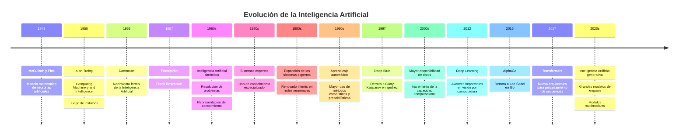

# Línea de tiempo de la Inteligencia Artificial

Esta línea de tiempo presenta algunos acontecimientos representativos de la evolución de la Inteligencia Artificial.

---

## Interpretación

La evolución de la Inteligencia Artificial no debe entenderse como una sustitución completa de tecnologías anteriores.

A lo largo de su historia han surgido diferentes paradigmas y técnicas que actualmente continúan coexistiendo, entre ellas:

a) Representación simbólica

b) Búsqueda

c) Razonamiento lógico

d) Métodos probabilísticos

e) Aprendizaje automático

f) Redes neuronales profundas

g) Aprendizaje por refuerzo

h) Modelos generativos

Los sistemas contemporáneos pueden combinar varias de estas aproximaciones.

---

## Idea clave

> **La evolución de la Inteligencia Artificial puede entenderse como la incorporación progresiva de nuevas formas de representar conocimiento, aprender, razonar y resolver problemas.**

---

[← Volver a recursos](./)

[← Volver al subtema 1.1](../)
