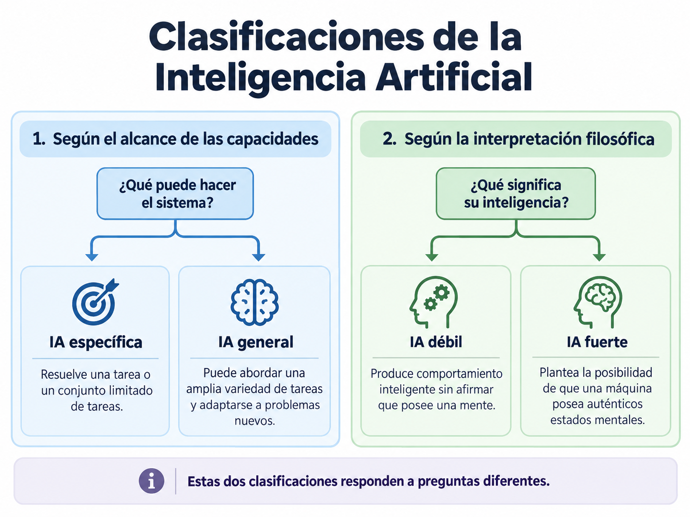
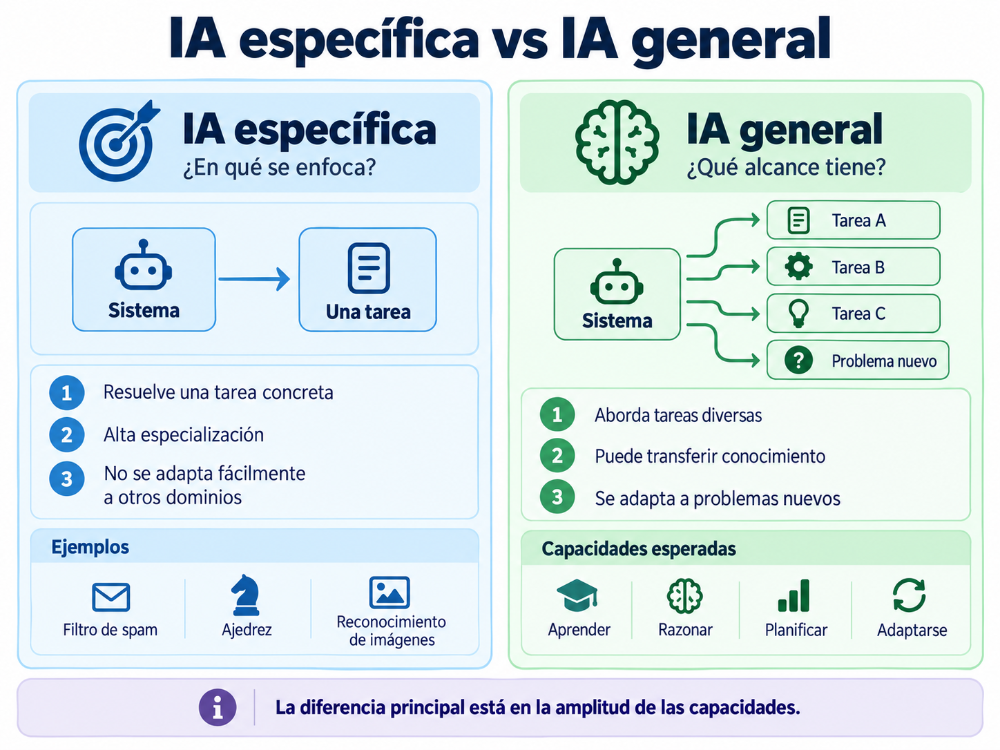
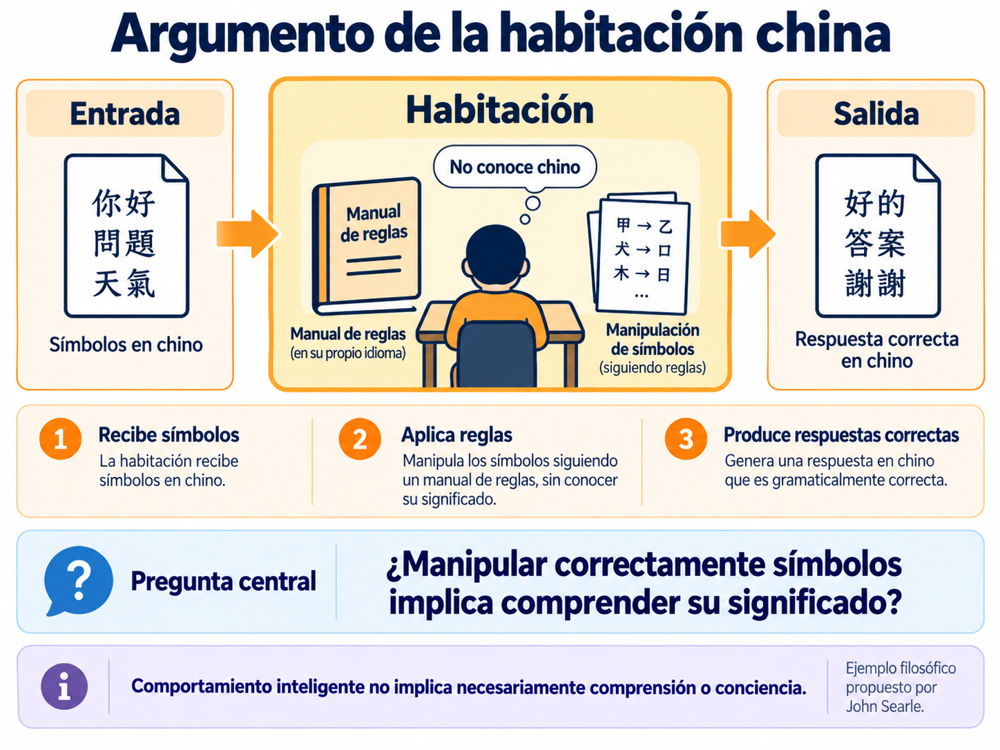

# 1.4 Clasificación de la Inteligencia Artificial

## Propósito

Distinguir diferentes formas de clasificar los sistemas de Inteligencia Artificial, particularmente de acuerdo con:

a) El alcance de sus capacidades: **IA específica e IA general**

b) La interpretación filosófica de su inteligencia: **IA débil e IA fuerte**

La finalidad es comprender que estas categorías responden a preguntas diferentes y evitar utilizarlas como si fueran equivalentes.

---

# 1. ¿Por qué clasificar la Inteligencia Artificial?

La expresión **Inteligencia Artificial** incluye sistemas con capacidades muy diferentes.

Por ejemplo:

```text
Filtro de correo spam

Sistema de reconocimiento de imágenes

Programa de ajedrez

Asistente conversacional

Robot autónomo
```

Todos pueden utilizar técnicas de IA, pero no necesariamente poseen las mismas capacidades ni fueron diseñados para los mismos objetivos.

Para este subtema utilizaremos dos preguntas:

```text
1. ¿Qué tan amplio es el conjunto de tareas que puede realizar?

2. ¿El sistema solamente presenta comportamiento inteligente
   o realmente posee una mente?
```

Estas preguntas conducen a dos clasificaciones diferentes.



---

# 2. IA específica

La **Inteligencia Artificial específica**, también denominada **Narrow AI** o **Artificial Narrow Intelligence (ANI)**, está diseñada para realizar una tarea determinada o un conjunto limitado de tareas.

Ejemplos:

a) Clasificar un correo como spam o legítimo

b) Reconocer objetos en una imagen

c) Recomendar películas

d) Jugar ajedrez

e) Traducir texto

f) Detectar anomalías

g) Realizar predicciones

Un sistema especializado puede alcanzar un desempeño muy elevado dentro de su dominio.

Por ejemplo, un programa puede jugar ajedrez a un nivel extraordinario sin ser capaz de conducir un automóvil, diagnosticar una enfermedad o resolver cualquier otro problema de propósito general.

Por tanto:

> **IA específica no significa IA sencilla.**

La especialización se refiere al **alcance de sus capacidades**, no a la complejidad del sistema.

---

# 3. IA general

La **Inteligencia Artificial General**, comúnmente denominada **AGI — Artificial General Intelligence**, se refiere a la aspiración de desarrollar sistemas capaces de desenvolverse competentemente en una amplia variedad de tareas y adaptarse a problemas nuevos.

Entre las capacidades generalmente asociadas con una IA de propósito general se encuentran:

a) Aprender diferentes tipos de tareas

b) Transferir conocimiento entre dominios

c) Resolver problemas nuevos

d) Adaptarse a situaciones no previstas

e) Razonar

f) Planificar

g) Aprender de la experiencia

La diferencia esencial puede representarse de la siguiente manera.

### IA específica

```text
Sistema
   ↓
Tarea determinada
```

### IA general

```text
             Tarea A
                ↑
Tarea B ← Sistema → Tarea C
                ↓
           Nueva tarea
```



Un sistema capaz de realizar muchas funciones no necesariamente constituye una AGI.

La cuestión central es determinar si puede **adaptarse, transferir conocimientos y abordar competentemente problemas nuevos en diferentes dominios**.

---

# 4. IA débil e IA fuerte

La clasificación **débil/fuerte** responde originalmente a una cuestión diferente.

No pregunta principalmente cuántas tareas puede realizar una máquina, sino:

> **¿La máquina solamente se comporta como si fuera inteligente o realmente posee una mente?**

## IA débil

En su sentido filosófico, la **IA débil** sostiene que una máquina puede producir comportamiento inteligente sin que sea necesario afirmar que posee:

a) Conciencia

b) Experiencias subjetivas

c) Comprensión equivalente a la humana

d) Estados mentales propios

Puede representarse como:

```text
Entrada
   ↓
Procesamiento
   ↓
Comportamiento inteligente
```

El interés se encuentra principalmente en **lo que el sistema puede hacer**.

---

## IA fuerte

La **IA fuerte**, en su sentido filosófico original, plantea una afirmación mucho más profunda:

> **Una máquina suficientemente avanzada podría no limitarse a simular inteligencia, sino poseer auténticos estados mentales.**

La pregunta deja de ser únicamente:

```text
¿Produce una respuesta inteligente?
```

y pasa a ser:

```text
¿Comprende realmente lo que está haciendo?
```

Esta discusión pertenece tanto a la Inteligencia Artificial como a la filosofía de la mente y las ciencias cognitivas.

---

# 5. El argumento de la habitación china

Uno de los argumentos más conocidos relacionados con esta discusión fue propuesto por **John Searle**.

Imagine una persona que no conoce chino.

La persona recibe símbolos escritos en chino y dispone de un conjunto detallado de reglas que indican cómo responder.

```text
Símbolos de entrada
        ↓
Manual de reglas
        ↓
Manipulación de símbolos
        ↓
Respuesta correcta
```

Desde fuera de la habitación podría parecer que la persona comprende chino.

Sin embargo, únicamente está aplicando reglas para manipular símbolos.



La pregunta planteada es:

> **¿Manipular correctamente símbolos implica realmente comprender su significado?**

El objetivo de este ejemplo no es resolver el debate, sino distinguir entre:

```text
Comportamiento inteligente
```

y:

```text
Comprensión o conciencia
```

---

# 6. Las clasificaciones no son equivalentes

Una de las confusiones más frecuentes consiste en tratar estas categorías como si significaran lo mismo.

Sin embargo:

| Clasificación | Pregunta principal |
|---|---|
| **IA específica / IA general** | ¿Qué amplitud tienen sus capacidades? |
| **IA débil / IA fuerte** | ¿El comportamiento inteligente implica una mente real? |

Por tanto:

```text
Específica / General
```

se refiere principalmente al **alcance de las capacidades**.

Mientras que:

```text
Débil / Fuerte
```

corresponde originalmente a una **discusión filosófica acerca de la naturaleza de la inteligencia y la mente**.

En algunos textos contemporáneos el término **Strong AI** también se utiliza de manera aproximada para referirse a sistemas de propósito general o de nivel humano.

Por esta razón, es importante identificar el contexto en el que se utiliza.

---

# 7. Errores conceptuales frecuentes

## Error 1

```text
IA específica = IA sencilla
```

**Incorrecto.**

Una IA específica puede ser extremadamente compleja y superar ampliamente a las personas dentro de un dominio concreto.

---

## Error 2

```text
Superar a una persona en una tarea = AGI
```

**Incorrecto.**

Un desempeño extraordinario en una tarea específica no demuestra capacidad general.

---

## Error 3

```text
IA débil = IA poco potente
```

**Incorrecto.**

El término *débil* no se refiere a capacidad de cómputo ni a calidad del sistema.

---

## Error 4

```text
IA fuerte = sistema muy potente
```

**Impreciso.**

En su significado filosófico original, IA fuerte se relaciona con la posibilidad de que una máquina posea auténticos estados mentales.

---

## Error 5

```text
Comportamiento semejante al humano = conciencia
```

**No necesariamente.**

La capacidad de producir determinado comportamiento y la existencia de conciencia son cuestiones diferentes.

---

# 8. Ejemplo comparativo

Consideremos un sistema especializado en jugar ajedrez.

Desde el punto de vista de su alcance puede clasificarse como:

```text
IA específica
```

porque su capacidad se concentra en un dominio determinado.

Aunque el sistema juegue mejor que la mayoría de las personas, ese resultado no demuestra automáticamente que pueda:

```text
Comprender cualquier problema

Aprender cualquier tarea

Transferir conocimiento a otros dominios

Poseer conciencia
```

Este ejemplo permite distinguir:

> **Desempeño especializado, inteligencia general y conciencia son conceptos diferentes.**

---

# 9. Nota sobre superinteligencia artificial

También puede encontrarse el término:

**Artificial Superintelligence — ASI**

que hace referencia hipotéticamente a sistemas cuyas capacidades intelectuales superarían ampliamente las capacidades humanas en numerosos ámbitos.

Una representación simplificada basada en nivel y amplitud de capacidad sería:

```text
IA específica
      ↓
IA general
      ↓
Superinteligencia artificial
```

Este concepto se analizará con mayor profundidad en la **Unidad 8. Ética y aspectos sociales de la Inteligencia Artificial**.

---

# Síntesis

Para clasificar correctamente un sistema de IA conviene realizar dos preguntas diferentes.

## Según el alcance

> **¿Qué variedad de tareas puede realizar?**

```text
IA específica ↔ IA general
```

## Según la interpretación filosófica

> **¿Únicamente presenta comportamiento inteligente o realmente posee una mente?**

```text
IA débil ↔ IA fuerte
```

Por ello:

```text
Específica / General
≠
Débil / Fuerte
```

aunque algunos usos contemporáneos de **Strong AI** pueden aproximarlo al concepto de **AGI**.

> **La amplitud de las capacidades de un sistema y la existencia de una mente consciente son cuestiones diferentes y no deben confundirse al clasificar sistemas de Inteligencia Artificial.**

---

## Actividades de aprendizaje

[Actividad: Clasificación de sistemas de IA](actividades/actividad-clasificacion-ia.md)

[Actividad: Análisis crítico de afirmaciones sobre IA](actividades/actividad-analisis-critico.md)

---

## Recursos del subtema

[Recursos y lecturas](recursos/)

---

## Fuentes base

Russell, S. J., & Norvig, P. (2021). *Artificial Intelligence: A Modern Approach* (4th ed.). Pearson.

Searle, J. R. (1980). Minds, Brains, and Programs. *Behavioral and Brain Sciences, 3*(3), 417–424.

---

[← Volver a la Unidad 1](../)
