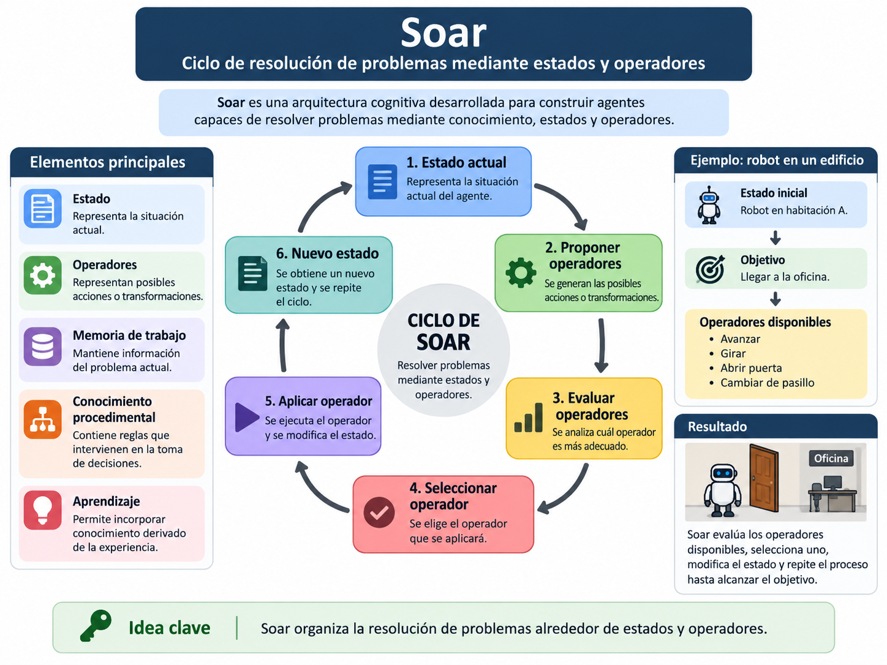
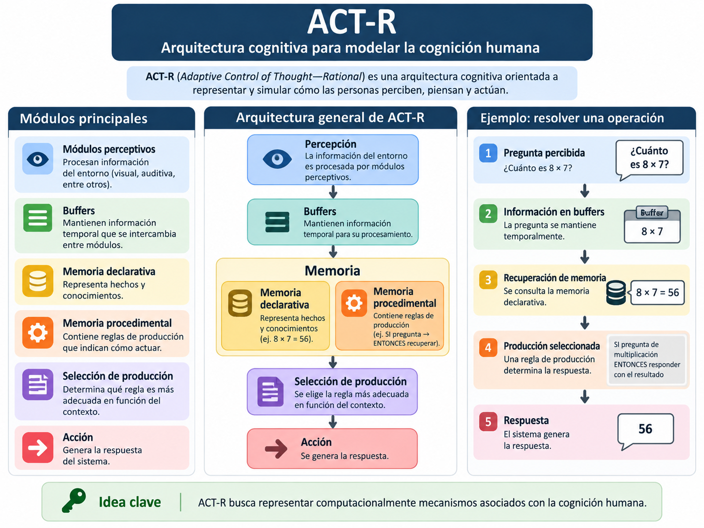
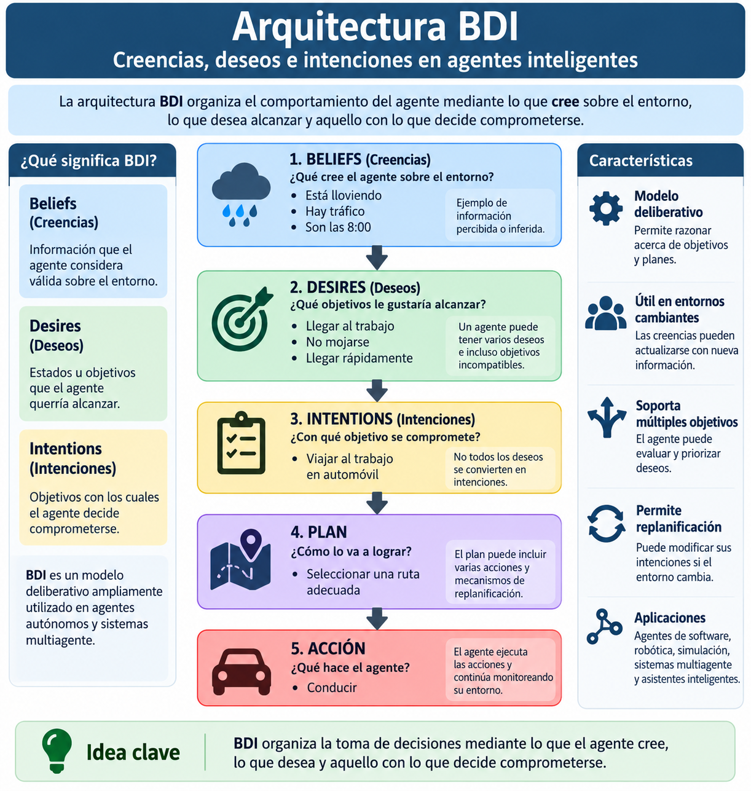
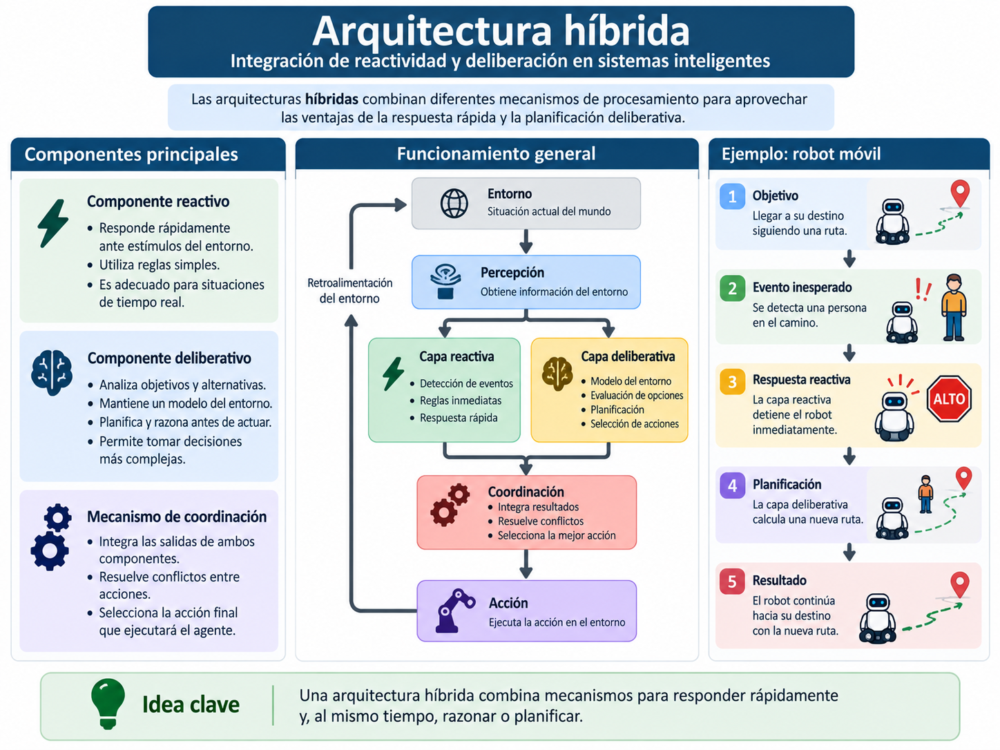

# 1.5 Arquitecturas clásicas y modernas de Inteligencia Artificial

## Propósito

Comprender las características fundamentales de **Soar, ACT-R, BDI y las arquitecturas híbridas**, identificando cómo organizan el conocimiento, la memoria, los objetivos, el razonamiento y la selección de acciones.

La pregunta central es:

> **¿Cómo puede organizarse internamente un sistema inteligente para decidir qué hacer?**

---

## 1. ¿Qué es una arquitectura de Inteligencia Artificial?

Una arquitectura de IA establece la organización de los componentes y mecanismos que permiten a un sistema:

a) Representar conocimiento

b) Mantener información en memoria

c) Razonar

d) Trabajar con objetivos

e) Seleccionar acciones

f) Aprender

De manera simplificada:

```text
Percepción
    ↓
┌─────────────────────┐
│     ARQUITECTURA    │
│                     │
│ Memoria             │
│ Conocimiento        │
│ Objetivos           │
│ Razonamiento        │
│ Aprendizaje         │
│ Decisión            │
└─────────────────────┘
    ↓
 Acción
```

Una arquitectura **no es un algoritmo específico**. Puede integrar diferentes técnicas de Inteligencia Artificial.

---

# 2. Soar

**Soar** es una arquitectura cognitiva desarrollada para construir agentes capaces de resolver problemas mediante conocimiento, estados y operadores.

Su funcionamiento puede comprenderse mediante el siguiente ciclo:

```text
Estado actual
      ↓
Proponer operadores
      ↓
Evaluar operadores
      ↓
Seleccionar operador
      ↓
Aplicar operador
      ↓
Nuevo estado
```

### Elementos principales

a) **Estado:** representa la situación actual

b) **Operadores:** representan posibles acciones o transformaciones

c) **Memoria de trabajo:** mantiene información del problema actual

d) **Conocimiento procedimental:** contiene reglas que intervienen en la toma de decisiones

e) **Aprendizaje:** permite incorporar conocimiento derivado de la experiencia

### Ejemplo

Un robot debe llegar de una habitación a una oficina.

```text
Estado:
Robot en habitación A

Objetivo:
Llegar a la oficina

Operadores:
Avanzar
Girar
Abrir puerta
Cambiar de pasillo
```

Soar evalúa los operadores disponibles, selecciona uno, modifica el estado y repite el proceso.

> **Idea clave: Soar organiza la resolución de problemas alrededor de estados y operadores.**



---

# 3. ACT-R

**ACT-R — Adaptive Control of Thought—Rational** es una arquitectura cognitiva orientada principalmente a **modelar procesos de la cognición humana**.

Su interés no consiste únicamente en resolver correctamente una tarea, sino en representar cómo podrían intervenir procesos como memoria, percepción y selección de acciones.

Una representación simplificada es:

```text
Percepción
    ↓
Buffers
    ↓
Memoria
    ↓
Reglas de producción
    ↓
Selección
    ↓
Acción
```

Dos tipos de conocimiento son especialmente importantes:

### Memoria declarativa

Representa hechos y conocimientos.

```text
8 × 7 = 56
```

### Memoria procedimental

Representa conocimiento sobre cómo actuar.

```text
SI aparece una señal roja
ENTONCES detenerse
```

### Ejemplo

```text
Pregunta: ¿Cuánto es 8 × 7?
        ↓
Percepción
        ↓
Recuperación de memoria
        ↓
8 × 7 = 56
        ↓
Producción seleccionada
        ↓
Respuesta: 56
```

> **Idea clave: ACT-R busca representar computacionalmente mecanismos asociados con la cognición humana.**



---

# 4. BDI

La arquitectura **BDI** organiza el comportamiento del agente mediante tres conceptos:

**Beliefs + Desires + Intentions**

o:

**Creencias + Deseos + Intenciones**

### Beliefs — Creencias

Representan la información que el agente considera válida acerca del entorno.

```text
Está lloviendo
Hay tráfico
Son las 8:00
```

### Desires — Deseos

Representan objetivos que podría intentar alcanzar.

```text
Llegar al trabajo
No mojarme
Llegar rápidamente
```

### Intentions — Intenciones

Representan los objetivos con los cuales el agente decide comprometerse.

```text
Ir al trabajo en automóvil
```

El ciclo puede resumirse como:

```text
Percepción
    ↓
Actualizar creencias
    ↓
Evaluar deseos
    ↓
Seleccionar intención
    ↓
Elegir plan
    ↓
Acción
```

### Ejemplo

```text
BELIEFS
Está lloviendo
Hay tráfico
        ↓
DESIRES
Llegar al trabajo
No mojarme
        ↓
INTENTION
Viajar en automóvil
        ↓
PLAN
Seleccionar una ruta
        ↓
ACCIÓN
Conducir
```

> **Idea clave: BDI organiza la toma de decisiones mediante lo que el agente cree, lo que desea y aquello con lo que decide comprometerse.**



---

# 5. Arquitecturas híbridas

Las **arquitecturas híbridas** combinan diferentes mecanismos de procesamiento.

Una combinación frecuente es:

**Reactividad + Deliberación**

### Componente reactivo

Responde rápidamente ante una situación.

```text
Obstáculo detectado
        ↓
Detenerse
```

### Componente deliberativo

Analiza objetivos y alternativas.

```text
Objetivo
   ↓
Evaluar opciones
   ↓
Planificar
   ↓
Seleccionar acción
```

Una arquitectura híbrida puede integrar ambos:

```text
                 Percepción
                     ↓
          ┌──────────┴──────────┐
          ↓                     ↓
   Capa reactiva         Capa deliberativa
          ↓                     ↓
Respuesta inmediata        Planificación
          └──────────┬──────────┘
                     ↓
                Coordinación
                     ↓
                   Acción
```

### Ejemplo

Un robot sigue una ruta hacia su destino.

```text
Plan:
Continuar ruta
       ↓
Se detecta obstáculo
       ↓
Respuesta reactiva:
Detenerse
       ↓
Respuesta deliberativa:
Calcular nueva ruta
```

> **Idea clave: una arquitectura híbrida combina mecanismos para responder rápidamente y, al mismo tiempo, razonar o planificar.**



---

# 6. Comparación de arquitecturas

| Aspecto | Soar | ACT-R | BDI | Híbrida |
|---|---|---|---|---|
| Énfasis | Resolución de problemas | Cognición humana | Agentes orientados a objetivos | Integración de mecanismos |
| Elemento central | Estados y operadores | Memorias y producciones | Creencias, deseos e intenciones | Capas o componentes |
| Memoria | Varios tipos | Declarativa y procedimental | Creencias y estado interno | Depende del diseño |
| Planificación | Sí | Puede incorporarse | Importante | Generalmente sí |
| Aprendizaje | Sí | Sí | Depende de implementación | Puede incorporarse |
| Uso representativo | Agentes cognitivos | Modelado cognitivo | Agentes autónomos | Robótica y sistemas autónomos |

> Esta tabla es una síntesis didáctica. Cada arquitectura posee mayor complejidad interna.

---

# 7. ¿Cuál arquitectura utilizar?

No existe una arquitectura universalmente superior.

### Soar

Cuando interesa principalmente la **resolución de problemas mediante estados y operadores**.

### ACT-R

Cuando interesa **modelar procesos cognitivos humanos**.

### BDI

Cuando se requiere representar **información, objetivos, compromisos y planes**.

### Híbrida

Cuando el sistema necesita simultáneamente **respuesta rápida y planificación**.

> **La arquitectura debe seleccionarse de acuerdo con las características del problema y el comportamiento esperado del agente.**

---

# Síntesis

```text
Soar
↓
Estados + Operadores
```

```text
ACT-R
↓
Memoria + Producciones + Cognición
```

```text
BDI
↓
Creencias + Deseos + Intenciones
```

```text
Híbrida
↓
Reactividad + Deliberación
```

> **Una arquitectura de Inteligencia Artificial define cómo se organizan y coordinan los mecanismos internos que permiten a un sistema representar información, razonar, aprender y seleccionar acciones.**

---

## Actividades de aprendizaje

[Actividad: Comparación de arquitecturas](actividades/actividad-comparativa-arquitecturas.md)

[Actividad: Diseño conceptual de una arquitectura](actividades/actividad-diseno-arquitectura.md)

---

## Recursos del subtema

[Recursos y lecturas](recursos/)

---

## Fuentes base

Russell, S. J., & Norvig, P. (2021). *Artificial Intelligence: A Modern Approach* (4th ed.). Pearson.

Laird, J. E. (2012). *The Soar Cognitive Architecture*. MIT Press.

Anderson, J. R. (2007). *How Can the Human Mind Occur in the Physical Universe?* Oxford University Press.

Rao, A. S., & Georgeff, M. P. (1995). BDI agents: From theory to practice.

---

[← Volver a la Unidad 1](../)
