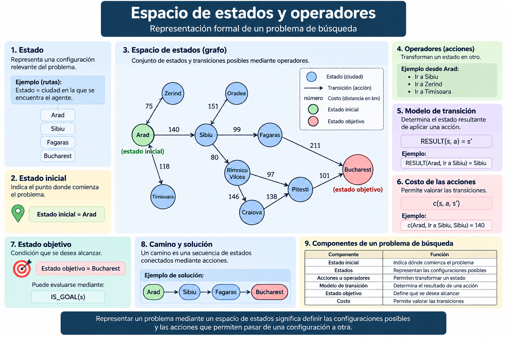

# 2.2 Espacios de estado y operadores

## Propósito

Comprender cómo representar un problema mediante **estados, acciones u operadores, transiciones, objetivos y costos**, de forma que posteriormente pueda ser resuelto mediante algoritmos de búsqueda.

---

## 1. Del problema a su representación

En el subtema anterior se definió **qué debe resolver el sistema**.

Ahora debemos representar el problema de forma computacional.

Ejemplo:

> Encontrar una ruta entre un origen y un destino.

Una representación posible es:

```text
Lugar actual
     ↓
Estado

Moverse entre lugares
     ↓
Acción u operador

Destino
     ↓
Estado objetivo
```

---

## 2. Estado

Un **estado** representa una configuración relevante del problema en un momento determinado.

En un problema de rutas:

```text
Estado = lugar donde se encuentra el agente
```

Ejemplos:

```text
Arad
Sibiu
Fagaras
Bucharest
```

En otros problemas, un estado puede representar configuraciones más complejas, como la posición de las piezas de un rompecabezas.

---

## 3. Estado inicial

El **estado inicial** indica el punto desde el cual comienza la resolución del problema.

Ejemplo:

```text
Estado inicial = Arad
```

---

## 4. Acciones u operadores

Las **acciones** u **operadores** representan las transformaciones que pueden aplicarse a un estado.

Desde:

```text
Arad
```

podrían existir las acciones:

```text
Ir a Sibiu
Ir a Zerind
Ir a Timisoara
```

El conjunto de acciones disponibles en un estado puede expresarse como:

\[
A(s)
\]

---

## 5. Modelo de transición

El modelo de transición especifica qué estado se obtiene después de ejecutar una acción.

Puede expresarse como:

\[
RESULT(s,a)=s'
\]

donde:

```text
s  = Estado actual
a  = Acción
s' = Nuevo estado
```

Ejemplo:

```text
RESULT(Arad, Ir a Sibiu) = Sibiu
```

---

## 6. Estado objetivo

El **estado objetivo** representa la condición que se desea alcanzar.

Ejemplo:

```text
Estado objetivo = Bucharest
```

Puede evaluarse mediante una condición conceptual como:

\[
IS\_GOAL(s)
\]

Ejemplo:

```text
IS_GOAL(Bucharest) = verdadero
```

Un problema puede tener uno o varios estados que satisfagan la condición objetivo.

---

## 7. Costos

Las acciones pueden tener diferentes costos.

En un problema de rutas el costo puede representar:

```text
Distancia
Tiempo
Combustible
Dinero
```

Ejemplo:

```text
Arad → Sibiu = 140 km
```

El costo de una transición puede expresarse como:

\[
c(s,a,s')
\]

La suma de los costos de las acciones realizadas constituye el **costo del camino**.

---

## 8. Espacio de estados

El **espacio de estados** representa las configuraciones posibles del problema y las transiciones existentes entre ellas.

Puede visualizarse como un grafo:

```text
        B
       / \
      A   D
       \ /
        C
```

En esta representación:

```text
Nodos   = Estados
Aristas = Acciones o transiciones
```

---

## 9. Camino y solución

Un **camino** es una secuencia de estados conectados mediante acciones.

Ejemplo:

```text
Arad
 ↓
Sibiu
 ↓
Fagaras
 ↓
Bucharest
```

Una **solución** es una secuencia de acciones que comienza en el estado inicial y alcanza un estado objetivo.

Puede representarse como:

\[
Solución = \langle a_1,a_2,\ldots,a_n\rangle
\]

---

## 10. Componentes de un problema de búsqueda

| Componente | Función |
|---|---|
| **Estado inicial** | Indica dónde comienza el problema |
| **Estados** | Representan las configuraciones posibles |
| **Acciones u operadores** | Permiten transformar un estado |
| **Modelo de transición** | Determina el resultado de una acción |
| **Estado objetivo** | Define qué se desea alcanzar |
| **Costo** | Permite valorar las transiciones |

Estos elementos constituyen la base para representar formalmente un problema de búsqueda.

---

## 11. Espacio de estados y árbol de búsqueda

No deben confundirse.

```text
ESPACIO DE ESTADOS
        ↓
Representa el problema

ÁRBOL DE BÚSQUEDA
        ↓
Representa cómo un algoritmo explora ese problema
```

El espacio de estados existe independientemente del algoritmo utilizado.

El árbol de búsqueda depende de la estrategia empleada para explorar los estados.

Esta diferencia será importante al estudiar BFS, DFS y otros algoritmos.

---

## 12. Ejemplo integrado

### Problema

Encontrar una ruta desde **Arad** hasta **Bucharest**.

### Estado inicial

```text
Arad
```

### Estados

```text
Ciudades del mapa
```

### Operadores

```text
Desplazarse a una ciudad conectada
```

### Modelo de transición

```text
RESULT(Arad, Ir a Sibiu) = Sibiu
```

### Estado objetivo

```text
Bucharest
```

### Costo

```text
Distancia entre ciudades
```

### Solución posible

```text
Arad → Sibiu → Fagaras → Bucharest
```

---

## Idea clave

> **Representar un problema mediante un espacio de estados significa definir las configuraciones posibles y las acciones que permiten pasar de una configuración a otra.**

Una vez representado el problema, surge la siguiente pregunta:

> **¿En qué orden deben explorarse los estados para encontrar una solución?**

Esto conduce al estudio de la **búsqueda no informada**.

---

## Recurso visual



---

## Referencias

Russell, S. J., & Norvig, P. (2021). *Artificial Intelligence: A Modern Approach* (4th ed.). Pearson.

Poole, D. L., & Mackworth, A. K. (2023). *Artificial Intelligence: Foundations of Computational Agents* (3rd ed.). Cambridge University Press.  
https://www.cs.ubc.ca/~poole/aibook/3e/html/ArtInt3e.html

---

## Recursos complementarios

[Consultar recursos del subtema](recursos/)

---

## Actividad de aprendizaje

[Representación de un problema mediante espacios de estado](actividades/actividad-representacion-problema.md)

---

[← Volver a la Unidad 2](../)
