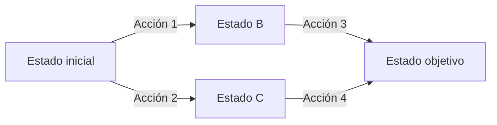

# Actividad de aprendizaje

## Representación de un problema mediante espacios de estado

## Propósito

Representar formalmente un problema de Inteligencia Artificial mediante estados, acciones u operadores, transiciones, estado inicial, objetivo y costos.

La finalidad es preparar el problema para su posterior resolución mediante algoritmos de búsqueda.

---

## 1. Selección del problema

Selecciona uno de los siguientes problemas o propone uno equivalente:

a) Encontrar una ruta entre dos lugares

b) Resolver un laberinto

c) Organizar bloques para alcanzar una configuración objetivo

d) Resolver un rompecabezas

e) Mover un robot dentro de un entorno

f) Transportar objetos entre ubicaciones

---

## 2. Definición de los estados

Describe:

a) ¿Qué representa un estado?

b) ¿Qué información debe contener?

c) ¿Cuántos estados diferentes podrían existir aproximadamente?

Incluye al menos **cinco ejemplos de estados**.

---

## 3. Estado inicial y estado objetivo

Define claramente:

```text
Estado inicial =
```

```text
Estado objetivo =
```

Explica por qué ambos estados son relevantes para la resolución del problema.

---

## 4. Acciones u operadores

Identifica las acciones que pueden ejecutarse.

Completa una tabla como la siguiente:

| Estado | Acción u operador | Estado resultante |
|---|---|---|
| | | |
| | | |
| | | |
| | | |

Incluye al menos **cinco transiciones válidas**.

---

## 5. Modelo de transición

Representa algunas transiciones utilizando la forma:

```text
RESULT(estado, acción) = nuevo estado
```

Ejemplo:

```text
RESULT(Arad, Ir a Sibiu) = Sibiu
```

Escribe al menos **cinco ejemplos** correspondientes a tu problema.

---

## 6. Costos

Determina si las acciones tienen costo.

El costo puede representar, por ejemplo:

```text
Distancia
Tiempo
Energía
Dinero
Número de movimientos
```

Si todas las acciones tienen el mismo costo, indícalo.

Si los costos son diferentes, proporciona al menos tres ejemplos.

---

## 7. Construcción del espacio de estados

Construye un diagrama que represente parte del espacio de estados.

Utiliza:

```text
Nodos
=
Estados

Aristas
=
Acciones o transiciones
```

Identifica visualmente:

a) Estado inicial

b) Estado objetivo

c) Acciones

d) Costos, cuando existan

Puedes realizar el diagrama con una herramienta digital o mediante Mermaid.

Ejemplo:



---

## 8. Camino y solución

Identifica al menos **dos caminos posibles** desde el estado inicial.

Ejemplo:

```text
Camino 1:
A → B → D

Camino 2:
A → C → D
```

Para cada camino determina:

a) Secuencia de acciones

b) Número de pasos

c) Costo total, si corresponde

d) Si alcanza o no el objetivo

---

## 9. Análisis

Responde:

a) ¿Todos los estados representados son alcanzables desde el estado inicial?

b) ¿Existen diferentes caminos para alcanzar el mismo estado?

c) ¿Existe más de una solución?

d) ¿Todas las soluciones tienen el mismo costo?

e) ¿Cuál considerarías la mejor solución y bajo qué criterio?

---

## 10. Espacio de estados y árbol de búsqueda

Explica brevemente la diferencia entre:

```text
Espacio de estados
```

y:

```text
Árbol de búsqueda
```

Indica cuál de los dos estás representando en esta actividad.

---

## Producto esperado

Elabora un documento que incluya:

a) Descripción del problema

b) Definición de los estados

c) Estado inicial

d) Estado objetivo

e) Acciones u operadores

f) Modelo de transición

g) Costos

h) Diagrama del espacio de estados

i) Dos caminos posibles

j) Análisis de los resultados

---

## Criterios de evaluación

| Criterio | Valor |
|---|---:|
| Definición correcta de estados | 20% |
| Identificación de acciones y transiciones | 20% |
| Estado inicial y objetivo | 15% |
| Representación gráfica del espacio de estados | 20% |
| Análisis de caminos y costos | 15% |
| Claridad y justificación | 10% |

---

## Reflexión final

Responde en máximo **100 palabras**:

> ¿Por qué una representación incorrecta del espacio de estados puede impedir que un algoritmo de búsqueda encuentre una solución adecuada?

---

## Recursos de apoyo

[Consultar contenido del subtema 2.2](../)

[Consultar recursos complementarios](../recursos/)

[Consultar espacio de estados y operadores](../imagenes/espacio-estados.png)

---

[← Volver al subtema 2.2](../)
