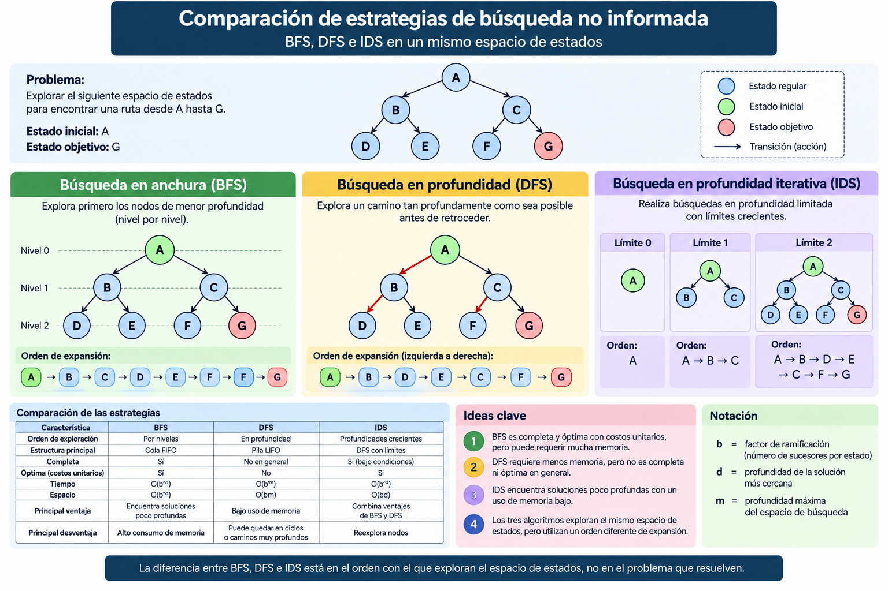

# 2.3 Búsqueda no informada

## Propósito

Comprender y comparar estrategias de búsqueda que exploran un espacio de estados sin utilizar información heurística sobre la cercanía al objetivo.

---

## 1. ¿Qué es la búsqueda no informada?

Una vez que un problema ha sido representado mediante estados, acciones y objetivos, es necesario decidir:

> **¿Qué estado debe explorarse primero?**

Las estrategias de búsqueda no informada utilizan únicamente la información contenida en la definición del problema.

No disponen de una estimación que indique qué estado parece estar más cerca del objetivo.

Las estrategias estudiadas en este subtema son:

```text
BFS
DFS
IDS
```

---

## 2. Criterios de comparación

Los algoritmos de búsqueda pueden analizarse mediante cuatro criterios principales:

| Criterio | Pregunta |
|---|---|
| **Completitud** | ¿Encuentra una solución si existe? |
| **Optimalidad** | ¿Encuentra la solución de menor costo? |
| **Tiempo** | ¿Cuántos nodos puede necesitar explorar? |
| **Espacio** | ¿Cuánta memoria puede requerir? |

Estos criterios permiten seleccionar una estrategia de acuerdo con las características del problema.

---

# 3. Búsqueda en anchura — BFS

**Breadth-First Search (BFS)** explora primero los estados que se encuentran a menor profundidad.

```text
Nivel 0
   ↓
Nivel 1
   ↓
Nivel 2
   ↓
Nivel 3
```

Normalmente utiliza una **cola FIFO**:

```text
Primero en entrar
        ↓
Primero en salir
```

### Ejemplo

```text
        A
       / \
      B   C
     / \ / \
    D  E F  G
```

Si se explora de izquierda a derecha:

```text
A → B → C → D → E → F → G
```

### Características

a) Es completa bajo condiciones habituales de búsqueda en espacios finitos

b) Es óptima cuando todas las acciones tienen el mismo costo

c) Puede requerir una gran cantidad de memoria

d) Es adecuada cuando la solución se encuentra relativamente cerca del estado inicial

Para un árbol con factor de ramificación \(b\) y una solución a profundidad \(d\), su crecimiento es aproximadamente:

\[
O(b^d)
\]

tanto en tiempo como en memoria [1].

### Idea clave

> **BFS explora por niveles.**

---

# 4. Búsqueda en profundidad — DFS

**Depth-First Search (DFS)** sigue un camino tan profundamente como sea posible antes de retroceder.

Normalmente utiliza una **pila LIFO**:

```text
Último en entrar
       ↓
Primero en salir
```

En el mismo ejemplo:

```text
        A
       / \
      B   C
     / \ / \
    D  E F  G
```

una exploración de izquierda a derecha podría seguir:

```text
A → B → D → E → C → F → G
```

### Características

a) Requiere menos memoria que BFS

b) Puede explorar caminos muy profundos antes de encontrar una solución

c) No garantiza encontrar la solución de menor costo

d) Puede presentar problemas en espacios infinitos o con ciclos no controlados

Para factor de ramificación \(b\) y profundidad máxima \(m\), DFS puede requerir aproximadamente:

\[
O(bm)
\]

de memoria [1].

### Idea clave

> **DFS prioriza profundidad y ahorro de memoria.**

---

# 5. Búsqueda en profundidad limitada

Una variante de DFS establece una profundidad máxima:

\[
\ell
\]

Ejemplo:

```text
Límite = 2
```

permite explorar:

```text
Profundidad 0  ✓
Profundidad 1  ✓
Profundidad 2  ✓
Profundidad 3  ✕
```

Su principal inconveniente es que una solución situada más allá del límite no será encontrada.

---

# 6. Búsqueda en profundidad iterativa — IDS

**Iterative Deepening Search (IDS)** ejecuta repetidamente búsquedas en profundidad con límites crecientes.

```text
Límite 0
   ↓
Límite 1
   ↓
Límite 2
   ↓
Límite 3
   ↓
...
```

Ejemplo:

```text
Límite 0:
A

Límite 1:
A → B → C

Límite 2:
A → B → D → E → C → F → G
```

IDS combina características de BFS y DFS:

```text
BFS
↓
Soluciones poco profundas

DFS
↓
Menor utilización de memoria

        ↓

IDS
```

Para una solución a profundidad \(d\):

\[
Tiempo = O(b^d)
\]

\[
Memoria = O(bd)
\]

[1]

### Idea clave

> **IDS aumenta progresivamente la profundidad de búsqueda.**

---

# 7. Comparación

| Característica | BFS | DFS | IDS |
|---|---|---|---|
| Exploración | Por niveles | En profundidad | Profundidades crecientes |
| Estructura | Cola FIFO | Pila LIFO | DFS limitada repetida |
| Completa | Sí* | No en general | Sí* |
| Óptima con costos unitarios | Sí | No | Sí |
| Memoria | Alta | Baja | Baja |
| Principal riesgo | Consumo de memoria | Caminos profundos o ciclos | Repetición de estados |

\* Bajo las condiciones correspondientes del espacio de búsqueda y control de estados.

---

# 8. Notación de complejidad

Utilizaremos:

\[
b = \text{factor de ramificación}
\]

Número promedio de sucesores generados por un estado.

\[
d = \text{profundidad de la solución más cercana}
\]

\[
m = \text{profundidad máxima del espacio}
\]

Por ejemplo:

```text
b = 3
d = 5
```

produce aproximadamente:

\[
3^5 = 243
\]

posibilidades en el nivel más profundo.

Esto ilustra el crecimiento exponencial que puede producirse en los espacios de búsqueda.

---

# 9. ¿Qué estrategia utilizar?

### BFS

Conviene cuando:

```text
La solución probablemente está cerca
+
La memoria disponible es suficiente
```

### DFS

Puede ser conveniente cuando:

```text
La memoria es limitada
+
El espacio de búsqueda está controlado
```

### IDS

Resulta útil cuando:

```text
No conocemos la profundidad de la solución
+
Deseamos conservar memoria
```

No existe una estrategia universalmente superior.

---

# 10. Ejemplo de comparación

Considere:

```text
        A
       / \
      B   C
     / \ / \
    D  E F  G
```

con:

```text
Estado inicial = A
Objetivo = G
```

### BFS

```text
A → B → C → D → E → F → G
```

### DFS

```text
A → B → D → E → C → F → G
```

### IDS

```text
Profundidad 0:
A

Profundidad 1:
A → B → C

Profundidad 2:
A → B → D → E → C → F → G
```

Los tres algoritmos exploran el mismo espacio de estados, pero utilizan un **orden diferente de expansión**.

---

## Idea clave

> **La diferencia fundamental entre BFS, DFS e IDS está en el orden utilizado para explorar el espacio de estados.**

---

## Recurso visual



---

## Notebook

[Implementación de BFS, DFS e IDS en Python](notebooks/busqueda-no-informada.ipynb)

El notebook permitirá observar y comparar:

a) Orden de exploración

b) Camino encontrado

c) Número de nodos visitados

d) Profundidad de la solución

e) Diferencias básicas entre las estrategias

---

## Referencias

[1] Russell, S. J., & Norvig, P. (2021). *Artificial Intelligence: A Modern Approach* (4th ed.). Pearson.

[2] Poole, D. L., & Mackworth, A. K. (2023). *Artificial Intelligence: Foundations of Computational Agents* (3rd ed.). Cambridge University Press.  
https://www.cs.ubc.ca/~poole/aibook/3e/html/ArtInt3e.html

---

## Recursos complementarios

[Consultar recursos del subtema](recursos/)

---

## Actividad de aprendizaje

[Comparación de estrategias de búsqueda no informada](actividades/actividad-comparacion-busquedas.md)

---

[← Volver a la Unidad 2](../)
