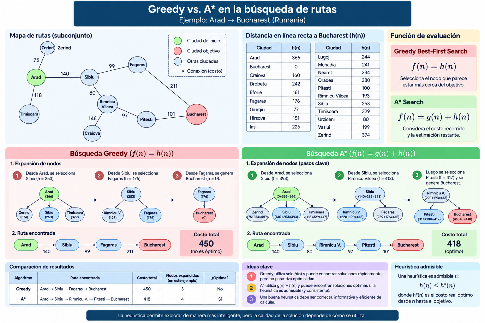

# 2.4 Búsqueda informada

## Propósito

Comprender cómo una **heurística** permite orientar la exploración de un espacio de estados y comparar el comportamiento de **Greedy Best-First Search** y **A\***.

---

## 1. ¿Qué es la búsqueda informada?

Las estrategias estudiadas anteriormente, como BFS, DFS e IDS, utilizan únicamente la información contenida en la definición del problema.

La búsqueda informada incorpora conocimiento adicional para estimar qué estados parecen más prometedores.

Esta información se representa mediante una función heurística:

\[
h(n)
\]

donde:

\[
h(n)=\text{estimación del costo restante hasta el objetivo}
\]

La heurística orienta la búsqueda, pero no representa necesariamente el costo real.

---

## 2. Función heurística

En un problema de rutas, una heurística puede ser:

```text
Distancia en línea recta
desde la ciudad actual
hasta el destino
```

Por ejemplo, para llegar a Bucharest:

```text
h(Arad)      = 366
h(Sibiu)     = 253
h(Fagaras)   = 176
h(Pitesti)   = 100
h(Bucharest) = 0
```

Un valor pequeño indica que el estado **parece estar más cerca del objetivo**.

---

## 3. Greedy Best-First Search

**Greedy Best-First Search** selecciona el nodo con menor valor heurístico.

Su función de evaluación es:

\[
f(n)=h(n)
\]

Por tanto:

> **Greedy selecciona el estado que parece encontrarse más cerca del objetivo.**

Ejemplo desde Arad:

| Estado | \(h(n)\) |
|---|---:|
| Zerind | 374 |
| Timisoara | 329 |
| Sibiu | **253** |

Greedy selecciona:

```text
Arad
 ↓
Sibiu
 ↓
Fagaras
 ↓
Bucharest
```

Costo del camino:

\[
140+99+211=450
\]

La estrategia puede encontrar rápidamente una solución, pero no garantiza que sea la de menor costo.

### Idea clave

> **Greedy considera principalmente lo que parece faltar para llegar al objetivo.**

---

## 4. Algoritmo A*

A\* combina el costo acumulado y la estimación restante.

\[
g(n)=\text{costo desde el estado inicial hasta }n
\]

\[
h(n)=\text{estimación desde }n\text{ hasta el objetivo}
\]

A\* utiliza:

\[
\boxed{f(n)=g(n)+h(n)}
\]

Por tanto:

```text
Costo recorrido
      +
Costo estimado restante
      ↓
Costo estimado total
```

---

## 5. Ejemplo de A*

Partiendo desde Arad:

| Estado | \(g(n)\) | \(h(n)\) | \(f(n)\) |
|---|---:|---:|---:|
| Sibiu | 140 | 253 | **393** |
| Timisoara | 118 | 329 | 447 |
| Zerind | 75 | 374 | 449 |

A\* selecciona primero **Sibiu**.

Posteriormente:

| Estado | \(g(n)\) | \(h(n)\) | \(f(n)\) |
|---|---:|---:|---:|
| Rimnicu Vilcea | 220 | 193 | **413** |
| Fagaras | 239 | 176 | 415 |

La ruta encontrada es:

```text
Arad
 ↓
Sibiu
 ↓
Rimnicu Vilcea
 ↓
Pitesti
 ↓
Bucharest
```

Costo:

\[
140+80+97+101=418
\]

En este caso A\* obtiene una solución de menor costo que Greedy.

---

## 6. Greedy vs. A*

```text
GREEDY
   ↓
h(n)
   ↓
¿Qué tan cerca parece estar el objetivo?
```

```text
A*
   ↓
g(n) + h(n)
   ↓
¿Cuánto he recorrido?
        +
¿Cuánto estimo que falta?
```

| Característica | Greedy | A* |
|---|---|---|
| Función | \(h(n)\) | \(g(n)+h(n)\) |
| Considera costo recorrido | No | Sí |
| Utiliza heurística | Sí | Sí |
| Puede encontrar rápidamente una solución | Sí | Sí |
| Optimalidad | No garantizada | Bajo condiciones adecuadas |
| Riesgo principal | Decisiones demasiado voraces | Consumo de tiempo y memoria |

---

## 7. Heurística admisible

Una heurística es **admisible** cuando nunca sobreestima el costo mínimo real para alcanzar el objetivo.

Formalmente:

\[
h(n)\leq h^*(n)
\]

donde:

\[
h^*(n)=\text{costo real óptimo desde }n\text{ hasta el objetivo}
\]

Ejemplo:

```text
Costo real = 120
h(n) = 100
```

es admisible.

En cambio:

```text
Costo real = 120
h(n) = 150
```

no es admisible.

### Idea clave

> **Una heurística admisible puede subestimar, pero no debe sobreestimar el costo real óptimo.**

---

## 8. Heurística consistente

Una heurística es consistente cuando cumple:

\[
h(n)\leq c(n,a,n')+h(n')
\]

Puede interpretarse como una condición de coherencia entre estados consecutivos.

Para este curso:

```text
Admisible
↓
No sobreestima

Consistente
↓
Mantiene coherencia entre transiciones
```

---

## 9. Calidad de una heurística

Una heurística admisible no necesariamente es útil.

Por ejemplo:

\[
h(n)=0
\]

no sobreestima el costo, pero tampoco proporciona información acerca de la cercanía al objetivo.

Por ello, una buena heurística debe ser:

```text
Correcta
+
Informativa
+
Computacionalmente razonable
```

---

## 10. Ejemplo adicional: 8-puzzle

Para un mismo problema pueden existir diferentes heurísticas.

Dos ejemplos clásicos son:

\[
h_1(n)=\text{número de piezas fuera de posición}
\]

y:

\[
h_2(n)=\text{suma de distancias Manhattan}
\]

Ambas pueden utilizarse para orientar A\*.

Este ejemplo muestra que:

> **La calidad de la heurística puede modificar significativamente el comportamiento de la búsqueda.**

---

## 11. Limitaciones de A*

Aunque A\* puede encontrar soluciones óptimas bajo determinadas condiciones, no elimina la complejidad del espacio de búsqueda.

En problemas grandes puede requerir:

```text
Muchos nodos
+
Mucho tiempo
+
Mucha memoria
```

Por ello, la calidad de la heurística es fundamental.

---

## Síntesis

\[
\boxed{h(n)=\text{estimación del costo restante}}
\]

\[
\boxed{Greedy:\ f(n)=h(n)}
\]

\[
\boxed{A^*:\ f(n)=g(n)+h(n)}
\]

```text
BFS / DFS / IDS
        ↓
Sin información heurística

Greedy
        ↓
h(n)

A*
        ↓
g(n) + h(n)
```

> **Greedy busca acercarse rápidamente al objetivo; A\* equilibra el costo recorrido con el costo estimado restante.**

---

## Recurso visual



---

## Notebook

[Implementación de Greedy y A* en Python](notebooks/busqueda-informada.ipynb)

---

## Referencias

Russell, S. J., & Norvig, P. (2021). *Artificial Intelligence: A Modern Approach* (4th ed.). Pearson.

Poole, D. L., & Mackworth, A. K. (2023). *Artificial Intelligence: Foundations of Computational Agents* (3rd ed.). Cambridge University Press.  
https://www.cs.ubc.ca/~poole/aibook/3e/html/ArtInt3e.html

---

## Recursos complementarios

[Consultar recursos del subtema](recursos/)

---

## Actividad de aprendizaje

[Comparación de búsqueda informada](actividades/actividad-comparacion-busqueda-informada.md)

---

[← Volver a la Unidad 2](../)
