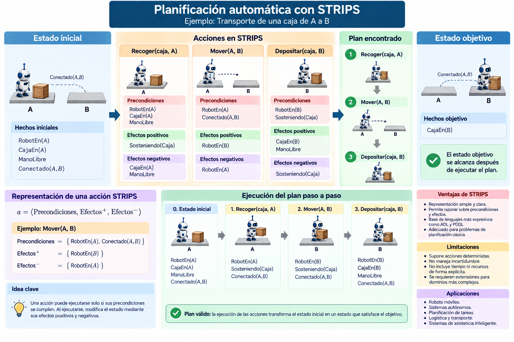

# 2.5 Planificación automática

## Propósito

Comprender cómo un sistema de Inteligencia Artificial puede generar automáticamente una **secuencia de acciones** que transforme un estado inicial en un estado que satisfaga un objetivo.

---

## 1. ¿Qué es la planificación automática?

La planificación automática busca responder:

> **¿Qué acciones deben ejecutarse, y en qué orden, para alcanzar un objetivo?**

Un problema de planificación puede representarse mediante:

```text
Estado inicial
      ↓
Acciones disponibles
      ↓
Secuencia de acciones
      ↓
Estado objetivo
```

La planificación utiliza representaciones explícitas de estados, acciones y objetivos para construir una solución.

Russell y Norvig presentan la planificación automática como una forma de resolución de problemas en la que los estados y las acciones poseen una estructura interna que puede ser utilizada por el planificador [1].

---

## 2. Búsqueda y planificación

La planificación está relacionada con la búsqueda, pero utiliza una representación más estructurada.

En búsqueda:

```text
Estado
  ↓
Acción
  ↓
Nuevo estado
```

En planificación:

```text
Acción
├── Precondiciones
└── Efectos
```

Esto permite determinar:

a) Cuándo puede ejecutarse una acción

b) Qué cambia después de ejecutarla

c) Qué acciones pueden acercar al sistema al objetivo

---

## 3. Planificación clásica

Para introducir el tema utilizaremos **planificación clásica**.

De manera simplificada, supone que:

a) El estado inicial es conocido

b) Las acciones tienen efectos definidos

c) El objetivo está claramente especificado

d) El sistema debe determinar una secuencia de acciones

Russell y Norvig presentan primero este modelo y posteriormente estudian extensiones para situaciones con incertidumbre, tiempo y recursos [1].

---

## 4. Estados mediante hechos

Un estado puede representarse mediante un conjunto de hechos.

Ejemplo:

```text
RobotEn(A)
CajaEn(A)
ManoLibre
Conectado(A,B)
```

Estos hechos describen qué condiciones son verdaderas en un momento determinado.

---

## 5. Precondiciones

Las **precondiciones** indican qué debe cumplirse antes de ejecutar una acción.

Ejemplo:

```text
Acción:
Recoger(Caja)

Precondiciones:
RobotEn(A)
CajaEn(A)
ManoLibre
```

Si alguna precondición no se cumple, la acción no puede ejecutarse.

---

## 6. Efectos

Los **efectos** indican cómo cambia el estado después de ejecutar una acción.

Pueden distinguirse:

```text
Efectos positivos
↓
Hechos que pasan a ser verdaderos
```

```text
Efectos negativos
↓
Hechos que dejan de ser verdaderos
```

Ejemplo:

```text
Acción:
Recoger(Caja)

Efectos positivos:
Sosteniendo(Caja)

Efectos negativos:
CajaEn(A)
ManoLibre
```

---

## 7. STRIPS

**STRIPS** significa:

**Stanford Research Institute Problem Solver**

Fue uno de los primeros sistemas importantes de planificación automática y se desarrolló originalmente en el contexto del robot Shakey.

Su representación básica describe una acción mediante:

```text
ACCIÓN
│
├── PRECONDICIONES
│
├── EFECTOS POSITIVOS
│
└── EFECTOS NEGATIVOS
```

STRIPS tuvo una influencia importante en lenguajes posteriores de planificación como ADL y PDDL [1].

---

## 8. Ejemplo

Supongamos que un robot debe transportar una caja desde **A** hasta **B**.

### Estado inicial

```text
RobotEn(A)
CajaEn(A)
ManoLibre
Conectado(A,B)
```

### Objetivo

```text
CajaEn(B)
```

---

## 9. Acción: Recoger

```text
Acción:
Recoger(Caja,A)

Precondiciones:
RobotEn(A)
CajaEn(A)
ManoLibre

Efectos positivos:
Sosteniendo(Caja)

Efectos negativos:
CajaEn(A)
ManoLibre
```

---

## 10. Acción: Mover

```text
Acción:
Mover(A,B)

Precondiciones:
RobotEn(A)
Conectado(A,B)

Efectos positivos:
RobotEn(B)

Efectos negativos:
RobotEn(A)
```

---

## 11. Acción: Depositar

```text
Acción:
Depositar(Caja,B)

Precondiciones:
RobotEn(B)
Sosteniendo(Caja)

Efectos positivos:
CajaEn(B)
ManoLibre

Efectos negativos:
Sosteniendo(Caja)
```

---

## 12. Construcción del plan

El plan resultante es:

```text
Recoger(Caja,A)
        ↓
Mover(A,B)
        ↓
Depositar(Caja,B)
```

Después de ejecutar las acciones:

```text
CajaEn(B)
```

se cumple el objetivo.

Por tanto:

\[
Plan=\langle a_1,a_2,a_3\rangle
\]

Un plan es una secuencia de acciones cuya ejecución permite alcanzar un estado que satisface el objetivo.

---

## 13. Representación compacta

Una acción puede resumirse como:

\[
a=
\langle
Precondiciones,
Efectos^+,
Efectos^-
\rangle
\]

Por ejemplo:

```text
Mover(A,B)
```

puede representarse mediante:

\[
Precondiciones =
\{RobotEn(A),Conectado(A,B)\}
\]

\[
Efectos^+ =
\{RobotEn(B)\}
\]

\[
Efectos^- =
\{RobotEn(A)\}
\]

---

## 14. ¿Dónde está la Inteligencia Artificial?

El programador define:

```text
Estado inicial
+
Objetivo
+
Acciones
+
Precondiciones
+
Efectos
```

y el planificador debe determinar:

```text
Recoger
   ↓
Mover
   ↓
Depositar
```

Por tanto:

> **Planificar significa encontrar automáticamente una secuencia válida de acciones que permita alcanzar un objetivo.**

---

## 15. STRIPS y PDDL

STRIPS constituye una base histórica y conceptual de la planificación.

Posteriormente surgieron lenguajes más expresivos, entre ellos:

```text
ADL
PDDL
```

PDDL permite representar dominios y problemas de planificación mediante estados, acciones, precondiciones y efectos [1].

---

## 16. Limitaciones

La planificación clásica utiliza supuestos simplificados.

Los problemas reales pueden incluir:

```text
Incertidumbre
Percepción incompleta
Acciones no deterministas
Tiempo
Recursos
Cambios inesperados
```

Por ello, existen modelos de planificación más avanzados para tratar estas situaciones [1].

---

## 17. Relación con agentes inteligentes

Un agente deliberativo puede utilizar planificación mediante el siguiente ciclo:

```text
Percepción
    ↓
Estado actual
    ↓
Objetivo
    ↓
Planificación
    ↓
Plan
    ↓
Ejecución
```

Esto conecta directamente con los agentes y arquitecturas estudiadas en la Unidad 1.

---

## Idea clave

> **Planificar consiste en determinar qué secuencia de acciones transforma el estado inicial en un estado que satisface el objetivo.**

---

## Recurso visual



---

## Referencias

[1] Russell, S. J., & Norvig, P. (2021). *Artificial Intelligence: A Modern Approach* (4th ed.). Pearson. Capítulo 11: Automated Planning.

[2] Fikes, R. E., & Nilsson, N. J. (1971). STRIPS: A new approach to the application of theorem proving to problem solving. *Artificial Intelligence, 2*(3–4), 189–208.

---

## Recursos complementarios

[Consultar recursos del subtema](recursos/)

---

## Actividad de aprendizaje

[Planificación de acciones mediante STRIPS](actividades/actividad-planificacion-strips.md)

---

[← Volver a la Unidad 2](../)
