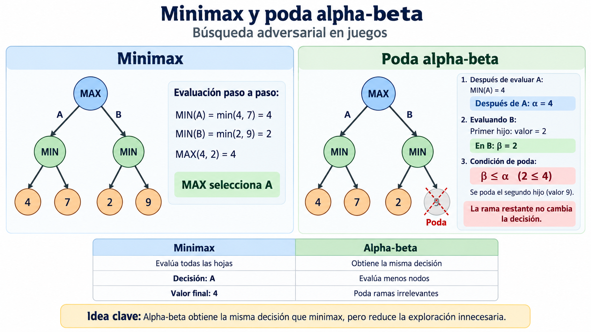

# 2.6 Juegos y adversarios

## Propósito

Comprender cómo un agente puede tomar decisiones cuando el resultado depende también de las acciones de un **oponente**, utilizando los algoritmos **minimax** y **poda alpha-beta**.

---

## 1. Búsqueda adversarial

En los problemas estudiados anteriormente, un agente seleccionaba acciones para alcanzar un objetivo.

En un juego adversarial existe además un oponente que intenta obtener un resultado favorable para sí mismo.

```text
Agente
   ↓
Selecciona una acción
   ↓
Oponente
   ↓
Selecciona una respuesta
```

Por tanto, el agente debe considerar:

> **¿Qué acción debo seleccionar considerando también la mejor respuesta posible de mi adversario?**

Russell y Norvig estudian este problema mediante árboles de juego y estrategias adversariales [1].

---

## 2. Árbol de juego

Un juego puede representarse mediante un árbol:

```text
              Estado actual
                   ↓
                  MAX
               /       \
            Acción A   Acción B
               ↓           ↓
              MIN         MIN
             /   \       /   \
            ... ...     ... ...
                 ↓
         Estados terminales
```

En esta representación:

```text
Nodos   = Estados del juego
Aristas = Acciones posibles
Hojas   = Estados terminales
```

---

## 3. Jugadores MAX y MIN

El modelo minimax utiliza dos jugadores.

### MAX

Busca maximizar el valor de utilidad:

```text
MAX
↓
Selecciona el mayor valor
```

### MIN

Busca minimizar la utilidad de MAX:

```text
MIN
↓
Selecciona el menor valor
```

Se supone que ambos jugadores toman decisiones óptimas.

---

## 4. Función de utilidad

Los estados terminales reciben un valor que representa el resultado desde la perspectiva de MAX.

Por ejemplo:

\[
U(s)=
\begin{cases}
+1 & \text{Victoria de MAX}\\
0 & \text{Empate}\\
-1 & \text{Victoria de MIN}
\end{cases}
\]

También pueden utilizarse otras escalas:

```text
Victoria  = +10
Empate    =   0
Derrota   = -10
```

Lo importante es que valores mayores representen resultados preferibles para MAX.

---

## 5. Minimax

El algoritmo **minimax** selecciona la mejor acción para MAX suponiendo que MIN también jugará de forma óptima.

Formalmente:

\[
MINIMAX(s)=
\begin{cases}
UTILITY(s) & \text{si }s\text{ es terminal}\\
\max MINIMAX(Result(s,a)) & \text{si juega MAX}\\
\min MINIMAX(Result(s,a)) & \text{si juega MIN}
\end{cases}
\]

Los valores de las hojas se propagan hacia la raíz alternando operaciones de máximo y mínimo [1].

---

## 6. Ejemplo de minimax

Considere:

```text
                 MAX
              /       \
             A         B
             ↓         ↓
            MIN       MIN
           /   \     /   \
          4     7   2     9
```

### Rama A

\[
MIN(4,7)=4
\]

### Rama B

\[
MIN(2,9)=2
\]

Finalmente:

\[
MAX(4,2)=4
\]

Por tanto:

```text
MAX selecciona A
```

Aunque una hoja de A tiene valor 7, MAX debe asumir que MIN seleccionará la respuesta que reduzca el resultado a 4.

> **Minimax elige la mejor decisión considerando la mejor respuesta posible del adversario.**

---

## 7. Propagación de valores

El procedimiento puede resumirse como:

```text
Estados terminales
        ↓
Asignar utilidades
        ↓
MIN selecciona mínimos
        ↓
MAX selecciona máximos
        ↓
Decisión en la raíz
```

---

## 8. Complejidad

Si:

\[
b=\text{factor de ramificación}
\]

y:

\[
m=\text{profundidad máxima del árbol}
\]

minimax puede requerir aproximadamente:

\[
O(b^m)
\]

evaluaciones.

Esto hace que explorar completamente árboles de juegos complejos resulte costoso [1].

---

## 9. Poda alpha-beta

La **poda alpha-beta** mejora minimax evitando explorar ramas que ya no pueden modificar la decisión final.

Mantiene dos valores:

\[
\alpha
\]

Mejor valor que MAX puede garantizar hasta el momento.

\[
\beta
\]

Mejor valor que MIN puede garantizar hasta el momento.

Cuando:

\[
\alpha \geq \beta
\]

la exploración de la rama puede detenerse.

---

## 10. Ejemplo de poda alpha-beta

Considere nuevamente:

```text
                 MAX
              /       \
             A         B
             ↓         ↓
            MIN       MIN
           /   \     /   \
          4     7   2     ?
```

Primero:

\[
MIN(4,7)=4
\]

Por tanto:

\[
\alpha=4
\]

Al comenzar la rama B aparece:

\[
2
\]

Como B es MIN:

\[
\beta=2
\]

Entonces:

\[
\beta \leq \alpha
\]

\[
2 \leq 4
\]

MAX ya dispone de una opción con valor 4 y nunca seleccionará una rama que MIN puede reducir a 2.

Por ello:

```text
La rama restante puede podarse
```

---

## 11. Minimax y alpha-beta

| Característica | Minimax | Alpha-beta |
|---|---|---|
| Modela MAX y MIN | Sí | Sí |
| Busca una decisión óptima | Sí | Sí |
| Resultado minimax | Igual | Igual |
| Explora ramas innecesarias | Puede hacerlo | Las elimina cuando es posible |
| Eficiencia | Menor | Mayor |
| Influencia del orden de movimientos | Moderada | Importante |

Russell y Norvig señalan que alpha-beta calcula el mismo movimiento óptimo que minimax, pero puede obtener una eficiencia considerablemente mayor al eliminar subárboles irrelevantes [1].

---

## 12. Importancia del orden de exploración

La cantidad de poda depende del orden en que se analizan las jugadas.

```text
Buenas jugadas primero
        ↓
Mejores límites α y β
        ↓
Más podas
        ↓
Menos estados evaluados
```

Con una ordenación ideal, alpha-beta puede reducir significativamente el número de nodos examinados [1].

---

## 13. Búsqueda clásica y adversarial

| Búsqueda clásica | Búsqueda adversarial |
|---|---|
| Un agente busca alcanzar un objetivo | Intervienen agentes con intereses opuestos |
| Se busca un camino | Se busca una estrategia |
| El resultado depende principalmente del agente | Depende también del adversario |
| BFS, DFS, A* | Minimax, alpha-beta |
| No existe un oponente deliberado | El oponente intenta perjudicar la decisión |

La diferencia fundamental es que en la búsqueda adversarial debemos anticipar decisiones tomadas por otro agente.

---

## 14. Juegos complejos

En juegos grandes no suele ser posible explorar todo el árbol.

Una estrategia práctica es:

```text
Árbol demasiado grande
        ↓
Limitar profundidad
        ↓
Evaluar estado no terminal
        ↓
Función de evaluación heurística
        ↓
Estimar utilidad
```

Russell y Norvig señalan que la búsqueda suele detenerse antes de alcanzar estados terminales y utilizar una función de evaluación para estimar la utilidad [1].

---

## 15. Alcance del modelo

Minimax y alpha-beta se estudian inicialmente en juegos:

```text
Dos jugadores
+
Turnos alternados
+
Acciones deterministas
+
Información perfecta
+
Intereses opuestos
```

Existen problemas más complejos con:

```text
Azar
Información parcial
Más de dos jugadores
Grandes espacios de búsqueda
```

Para estos casos existen extensiones como expectiminimax y Monte Carlo Tree Search, pero no serán desarrolladas en este subtema.

---

## Idea clave

```text
MINIMAX
   ↓
Anticipa decisiones de MAX y MIN

ALPHA-BETA
   ↓
Obtiene la misma decisión
   +
Evita explorar ramas irrelevantes
```

> **Minimax selecciona una acción suponiendo que el adversario jugará de manera óptima; alpha-beta obtiene la misma decisión minimax reduciendo la exploración innecesaria.**

---

## Recurso visual



---

## Notebook

[Implementación de minimax y poda alpha-beta en Python](notebooks/minimax-alpha-beta.ipynb)

---

## Referencias

[1] Russell, S. J., & Norvig, P. (2021). *Artificial Intelligence: A Modern Approach* (4th ed.). Pearson. Capítulo 6: Adversarial Search and Games.

[2] Knuth, D. E., & Moore, R. W. (1975). An analysis of alpha-beta pruning. *Artificial Intelligence, 6*(4), 293–326.

---

## Recursos complementarios

[Consultar recursos del subtema](recursos/)

---

## Actividad de aprendizaje

[Comparación de minimax y poda alpha-beta](actividades/actividad-minimax-alpha-beta.md)

---

[← Volver a la Unidad 2](../)
