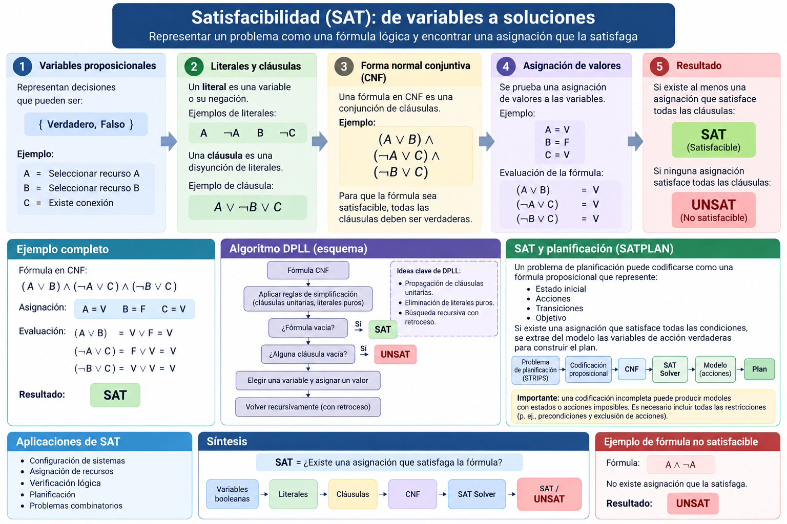

# 2.7 Satisfacibilidad — SAT

## Propósito

Comprender cómo determinados problemas pueden representarse mediante **variables booleanas y restricciones lógicas**, de forma que su solución consista en encontrar una asignación de valores de verdad que satisfaga simultáneamente todas las condiciones.

---

## 1. ¿Qué es SAT?

El problema de satisfacibilidad booleana pregunta:

> **¿Existe alguna asignación de valores verdadero/falso que haga verdadera una fórmula proposicional?**

Ejemplo:

\[
(A \lor B)\land(\neg A \lor C)
\]

Si:

```text
A = Verdadero
B = Falso
C = Verdadero
```

entonces ambas cláusulas son verdaderas.

Por tanto, la fórmula es:

```text
SAT
```

Si ninguna asignación logra satisfacerla, el resultado es:

```text
UNSAT
```

---

## 2. Variables proposicionales

Una variable proposicional puede tomar únicamente dos valores:

\[
\{Verdadero,Falso\}
\]

Ejemplo:

```text
A = El servidor A está activo
B = El servidor B está activo
C = Existe conexión
```

Una asignación podría ser:

```text
A = V
B = F
C = V
```

---

## 3. Literales y cláusulas

Un **literal** es una variable proposicional o su negación.

Ejemplos:

```text
A
¬A
B
¬C
```

Una **cláusula** es una disyunción de literales:

\[
A\lor\neg B\lor C
\]

---

## 4. Forma normal conjuntiva — CNF

Muchos algoritmos SAT trabajan con fórmulas en **Conjunctive Normal Form (CNF)**.

Una fórmula CNF tiene la estructura:

\[
C_1 \land C_2 \land \cdots \land C_n
\]

donde cada \(C_i\) es una cláusula.

Ejemplo:

\[
(A\lor B)
\land
(\neg A\lor C)
\land
(\neg B\lor C)
\]

Para que la fórmula sea satisfacible, **todas las cláusulas deben ser verdaderas**.

---

## 5. SAT y UNSAT

| Resultado | Significado |
|---|---|
| **SAT** | Existe al menos una asignación que satisface todas las cláusulas |
| **UNSAT** | No existe ninguna asignación que satisfaga todas las cláusulas |

Ejemplo de fórmula satisfacible:

\[
(A\lor B)\land(\neg A\lor C)
\]

Ejemplo de fórmula no satisfacible:

\[
A\land\neg A
\]

La segunda fórmula exigiría que \(A\) fuera verdadero y falso simultáneamente.

---

## 6. Ejemplo paso a paso

Considere:

\[
(A\lor B)
\land
(\neg A\lor C)
\land
(\neg B\lor C)
\]

Asignemos:

```text
A = V
B = F
C = V
```

Entonces:

\[
A\lor B = V
\]

\[
\neg A\lor C = V
\]

\[
\neg B\lor C = V
\]

Por tanto:

\[
V\land V\land V=V
\]

La fórmula es:

```text
SAT
```

---

## 7. SAT como problema de restricciones

SAT puede utilizarse para representar decisiones booleanas sujetas a restricciones.

Ejemplo:

```text
A = Seleccionar recurso A
B = Seleccionar recurso B
```

Si:

\[
A\lor B
\]

significa:

> Debe seleccionarse al menos uno.

Y:

\[
\neg A\lor\neg B
\]

significa:

> No pueden seleccionarse ambos simultáneamente.

La estructura general es:

```text
Variables
    ↓
Restricciones lógicas
    ↓
Fórmula
    ↓
Buscar asignación
    ↓
SAT / UNSAT
```

---

## 8. DPLL

Uno de los algoritmos clásicos para resolver problemas SAT es **DPLL**, denominado así por Davis, Putnam, Logemann y Loveland.

Conceptualmente:

```text
Fórmula CNF
     ↓
Asignar valores
     ↓
Simplificar cláusulas
     ↓
¿La fórmula se satisface?
     ↓
Sí → SAT

Si no:
Probar otra asignación
```

Entre sus ideas importantes se encuentran:

a) Propagación de cláusulas unitarias

b) Eliminación de literales puros

c) Búsqueda recursiva con retroceso

---

## 9. Cláusula unitaria

Una cláusula unitaria contiene un solo literal pendiente de satisfacción.

Ejemplo:

\[
\neg C
\]

obliga a:

\[
C=F
\]

Estas asignaciones forzadas permiten simplificar la fórmula antes de continuar la búsqueda.

---

## 10. Relación entre SAT y planificación

Un problema de planificación puede codificarse mediante proposiciones que representen:

```text
Estado inicial
+
Acciones
+
Transiciones
+
Objetivo
```

Después se pregunta si existe una asignación que satisfaga todas las condiciones.

Russell y Norvig presentan **SATPLAN**, cuyo procedimiento consiste en traducir el problema de planificación a una sentencia en CNF, aplicar un SAT solver y, si existe un modelo, extraer las variables que representan acciones verdaderas para construir el plan [1].

```text
Planificación
     ↓
Codificación proposicional
     ↓
CNF
     ↓
SAT Solver
     ↓
Modelo
     ↓
Plan
```

---

## 11. Aplicaciones

SAT puede utilizarse en problemas que puedan expresarse mediante:

```text
Decisiones booleanas
+
Restricciones lógicas
```

Ejemplos:

a) Configuración de sistemas

b) Asignación de recursos

c) Verificación lógica

d) Planificación

e) Problemas combinatorios

---

## 12. Limitación conceptual

El reto principal no consiste únicamente en resolver SAT, sino también en:

> **Representar correctamente el problema original mediante variables y cláusulas.**

Una codificación incompleta puede producir modelos que satisfacen la fórmula pero no representan soluciones válidas del problema real.

Russell y Norvig muestran este punto al explicar SATPLAN: si faltan restricciones, el SAT solver puede encontrar modelos con estados o acciones imposibles, por lo que deben incorporarse axiomas adicionales de precondición y exclusión de acciones [1].

---

## Síntesis

\[
\boxed{SAT=\text{¿Existe una asignación que satisfaga la fórmula?}}
\]

```text
Variables booleanas
        ↓
Literales
        ↓
Cláusulas
        ↓
CNF
        ↓
SAT Solver
        ↓
SAT / UNSAT
```

> **SAT transforma un conjunto de restricciones lógicas en la búsqueda de una asignación de valores de verdad que las satisfaga simultáneamente.**

---

## Recurso visual



---

## Referencias

[1] Russell, S. J., & Norvig, P. (2021). *Artificial Intelligence: A Modern Approach* (4th ed.). Pearson. Capítulo 7: Logical Agents.

[2] Davis, M., Logemann, G., & Loveland, D. (1962). A machine program for theorem-proving. *Communications of the ACM, 5*(7), 394–397.

---

## Recursos complementarios

[Consultar recursos del subtema](recursos/)

---

## Actividad de aprendizaje

[Resolución de problemas de satisfacibilidad](actividades/actividad-sat.md)

---

[← Volver a la Unidad 2](../)
