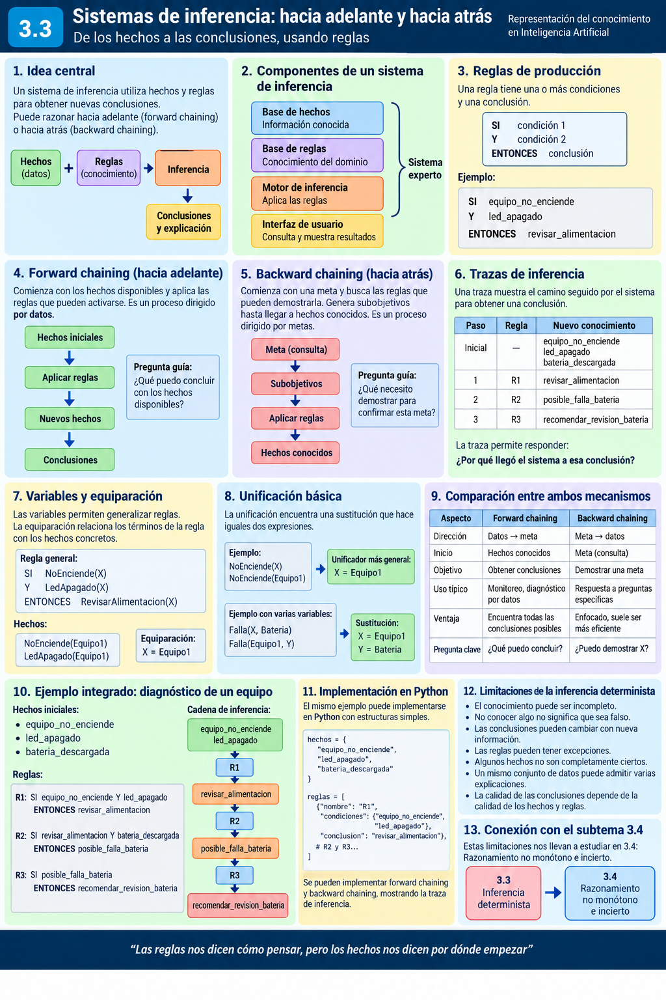
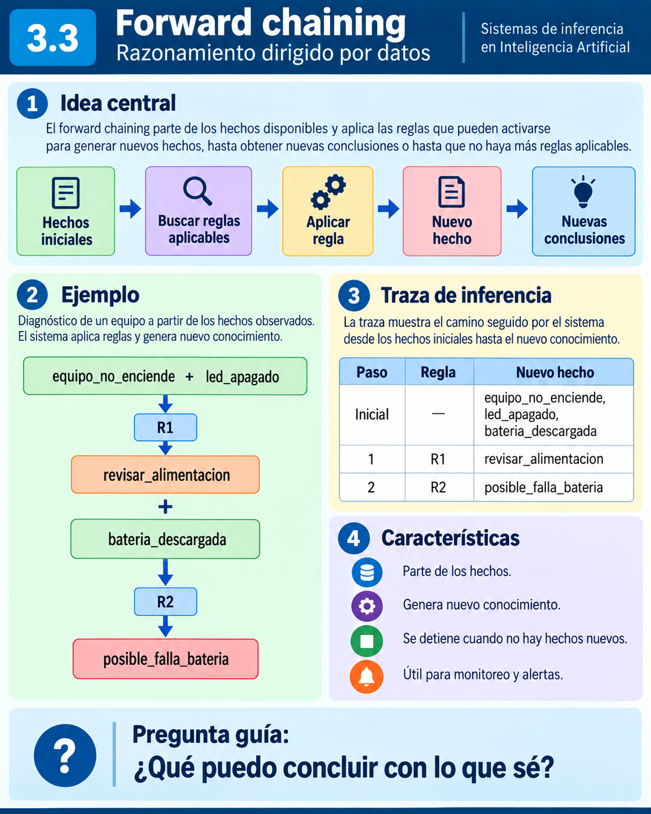
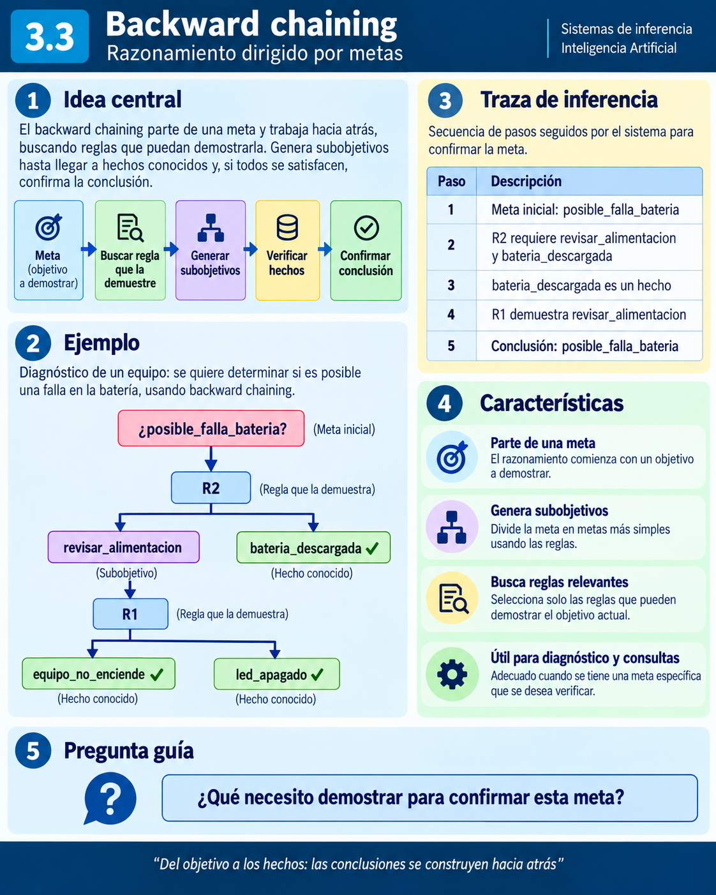

# 3.3 Sistemas de inferencia: hacia adelante y hacia atrás

## Propósito del subtema

Comprender cómo un sistema de Inteligencia Artificial puede utilizar una **base de hechos** y una **base de reglas** para obtener nuevas conclusiones mediante los mecanismos de **encadenamiento hacia adelante** (*forward chaining*) y **encadenamiento hacia atrás** (*backward chaining*).


<p align="center">
  
</p>


Este subtema da continuidad a lo estudiado previamente:

a) En **3.1** se utilizaron hechos, reglas y expresiones lógicas para representar conocimiento

b) En **3.2** se estudiaron formas estructuradas de organizar conceptos, propiedades y relaciones

c) En **3.3** se estudiará cómo un sistema puede **razonar con ese conocimiento**

La idea central puede resumirse así:

```text
Representar conocimiento
          ↓
   Hechos y reglas
          ↓
   Motor de inferencia
          ↓
 Nuevas conclusiones
```

> **Idea clave:** una base de conocimiento contiene información, pero el motor de inferencia permite utilizarla para obtener conocimiento que no estaba expresado explícitamente.

---

## 1. De representar conocimiento a razonar con él

Hasta este punto hemos estudiado distintas maneras de representar conocimiento.

Por ejemplo, podemos registrar los siguientes hechos:

```text
El equipo no enciende.
El indicador LED está apagado.
```

También podemos representar una regla:

```text
SI el equipo no enciende
Y el indicador LED está apagado
ENTONCES revisar la alimentación eléctrica.
```

Los dos primeros enunciados describen información conocida. La regla establece una relación entre condiciones y una conclusión.

Un sistema de inferencia utiliza ambos tipos de conocimiento para responder una pregunta como:

> **¿Qué debería revisarse si el equipo no enciende y el LED está apagado?**

El razonamiento sería:

```text
Equipo no enciende
        +
LED apagado
        ↓
Se cumplen las condiciones
de una regla
        ↓
Revisar alimentación eléctrica
```

La conclusión **“revisar alimentación eléctrica”** no estaba registrada como un hecho inicial. Se obtiene al aplicar una regla sobre los hechos disponibles.

A este proceso de obtener conclusiones a partir de conocimiento existente lo llamaremos **inferencia**.

### 1.1 ¿Qué significa inferir?

En el contexto de la IA simbólica, inferir significa **derivar nueva información a partir de hechos y reglas disponibles**.

Ejemplo:

```text
Hecho 1: El suelo está seco.
Hecho 2: No está lloviendo.

Regla:
SI el suelo está seco
Y no está lloviendo
ENTONCES activar el riego.
```

A partir de los dos hechos iniciales, el sistema puede obtener:

```text
Nuevo hecho: Activar el riego.
```

Visualmente:

```text
Suelo seco + No llueve
          ↓
      Aplicar regla
          ↓
     Activar riego
```

Lo importante no es el sistema de riego en sí, sino observar que una regla permite **transformar conocimiento disponible en una nueva conclusión**.

---

## 2. ¿Qué es un sistema de inferencia?

Un **sistema de inferencia** es un mecanismo que examina el conocimiento disponible y aplica reglas para determinar qué conclusiones pueden obtenerse.

En su forma más sencilla podemos representarlo así:

```text
Base de hechos
      +
Base de reglas
      ↓
Motor de inferencia
      ↓
Conclusiones
```

El motor de inferencia compara las condiciones de las reglas con la información disponible y determina qué reglas pueden utilizarse.

### Ejemplo

```text
Hechos:
Ana está inscrita.
Ana tiene una cuenta activa.

Regla:
SI un estudiante está inscrito
Y tiene una cuenta activa
ENTONCES puede acceder al curso.
```

Como ambas condiciones se cumplen, el sistema puede obtener:

```text
Ana puede acceder al curso.
```

Visualmente:

```text
Inscrita(Ana)
      +
CuentaActiva(Ana)
      ↓
Aplicación de la regla
      ↓
PuedeAcceder(Ana)
```

Este mecanismo es la base de muchos sistemas simbólicos y sistemas expertos.

---

## 3. Componentes básicos de un sistema de inferencia

Para entender cómo funciona un sistema de inferencia utilizaremos cuatro componentes básicos:

```text
Base de hechos
      +
Base de reglas
      ↓
Motor de inferencia
      ↓
Memoria de trabajo / conocimiento derivado
```

### 3.1 Base de hechos

La **base de hechos** contiene información que el sistema considera disponible en un momento determinado.

Ejemplo:

```text
equipo_no_enciende
led_apagado
```

Los hechos constituyen el punto de partida del razonamiento.

### 3.2 Base de reglas

La **base de reglas** contiene conocimiento que establece qué conclusión puede obtenerse cuando determinadas condiciones se cumplen.

Ejemplo:

```text
SI equipo_no_enciende
Y led_apagado
ENTONCES revisar_alimentacion
```

Una regla tiene dos partes principales:

```text
CONDICIONES  →  CONCLUSIÓN
```

También pueden denominarse:

```text
Antecedente  →  Consecuente
```

### 3.3 Motor de inferencia

El **motor de inferencia** es el componente encargado de utilizar los hechos y las reglas.

De manera simplificada realiza el siguiente proceso:

```text
1. Examinar los hechos disponibles
              ↓
2. Buscar reglas cuyas condiciones se cumplan
              ↓
3. Aplicar una regla
              ↓
4. Obtener una nueva conclusión
              ↓
5. Incorporar el nuevo conocimiento
```

Más adelante veremos que el orden en que se realiza este razonamiento depende de la estrategia utilizada:

a) **Encadenamiento hacia adelante:** comienza con los hechos

b) **Encadenamiento hacia atrás:** comienza con una meta o pregunta

### 3.4 Memoria de trabajo

Durante el proceso de inferencia pueden aparecer nuevos hechos.

La **memoria de trabajo** representa el conjunto de información disponible durante el razonamiento, incluyendo hechos iniciales y, dependiendo del sistema, conclusiones obtenidas.

Ejemplo:

```text
Estado inicial:

equipo_no_enciende
led_apagado
```

Después de aplicar una regla:

```text
equipo_no_enciende
led_apagado
revisar_alimentacion
```

La nueva información puede ser utilizada en pasos posteriores.

---

## 4. Reglas de producción

Una forma sencilla de representar conocimiento procedimental en sistemas simbólicos es mediante **reglas de producción**.

Su estructura general es:

```text
SI condición
ENTONCES conclusión
```

También pueden contener varias condiciones:

```text
SI condición_1
Y condición_2
ENTONCES conclusión
```

### 4.1 Antecedente y consecuente

Podemos dividir una regla en:

```text
SI A Y B  →  ENTONCES C
```

donde:

a) **A y B** forman el antecedente o conjunto de condiciones

b) **C** es el consecuente o conclusión

Ejemplo:

```text
SI suelo_seco
Y no_llueve
ENTONCES activar_riego
```

### 4.2 ¿Cuándo puede aplicarse una regla?

Una regla puede aplicarse cuando sus condiciones se encuentran satisfechas por los hechos disponibles.

```text
Hechos:
suelo_seco
no_llueve
```

```text
Regla:
SI suelo_seco
Y no_llueve
ENTONCES activar_riego
```

Como ambas condiciones están presentes:

```text
suelo_seco   ✓
no_llueve    ✓
```

la regla puede producir:

```text
activar_riego
```

Si solamente conocemos:

```text
suelo_seco
```

no podemos aplicar esa regla todavía, porque falta verificar:

```text
no_llueve
```

> **Una regla no se aplica simplemente porque exista. Sus condiciones deben satisfacerse de acuerdo con el conocimiento disponible.**

### 4.3 Encadenamiento de reglas

Considere:

```text
R1:
SI suelo_seco
Y no_llueve
ENTONCES activar_riego

R2:
SI activar_riego
ENTONCES abrir_valvula
```

Con los hechos:

```text
suelo_seco
no_llueve
```

podemos obtener:

```text
suelo_seco + no_llueve
          ↓
         R1
          ↓
    activar_riego
          ↓
         R2
          ↓
     abrir_valvula
```

La conclusión obtenida por una regla puede utilizarse para satisfacer las condiciones de otra. De ahí surge la idea de **encadenamiento**.

---

## 5. Encadenamiento hacia adelante

El **encadenamiento hacia adelante** (*forward chaining*) comienza con los **hechos conocidos** y aplica reglas de manera progresiva para obtener nuevas conclusiones.

Por esta razón se considera un razonamiento **dirigido por los datos** (*data-driven*).


<p align="center">
  
</p>


```text
HECHOS INICIALES
       ↓
Buscar reglas aplicables
       ↓
Aplicar una regla
       ↓
Obtener un nuevo hecho
       ↓
Agregarlo al conocimiento disponible
       ↓
Buscar nuevas reglas
```

El proceso continúa hasta que se alcanza una conclusión de interés o ya no existen reglas que produzcan conocimiento nuevo.

### 5.1 Ejemplo básico

Hechos:

```text
equipo_no_enciende
led_apagado
```

Regla:

```text
R1:
SI equipo_no_enciende
Y led_apagado
ENTONCES revisar_alimentacion
```

Verificación:

```text
equipo_no_enciende    ✓
led_apagado            ✓
```

Entonces:

```text
R1 → revisar_alimentacion
```

La memoria de trabajo queda:

```text
equipo_no_enciende
led_apagado
revisar_alimentacion
```

### 5.2 Encadenamiento de varias reglas

Hechos iniciales:

```text
equipo_no_enciende
led_apagado
bateria_descargada
```

Reglas:

```text
R1:
SI equipo_no_enciende
Y led_apagado
ENTONCES revisar_alimentacion
```

```text
R2:
SI revisar_alimentacion
Y bateria_descargada
ENTONCES posible_falla_bateria
```

La inferencia es:

```text
equipo_no_enciende
        +
led_apagado
        ↓
       R1
        ↓
revisar_alimentacion
        +
bateria_descargada
        ↓
       R2
        ↓
posible_falla_bateria
```

### 5.3 Traza de inferencia

Una **traza de inferencia** muestra paso a paso cómo se obtuvo una conclusión.

| Paso | Regla aplicada | Nuevo hecho |
|---|---|---|
| Inicial | — | equipo_no_enciende, led_apagado, bateria_descargada |
| 1 | R1 | revisar_alimentacion |
| 2 | R2 | posible_falla_bateria |

La traza permite explicar cómo el sistema llegó a una conclusión.

### 5.4 Ejemplo adicional: sistema de riego

Hechos:

```text
suelo_seco
no_llueve
deposito_con_agua
```

Reglas:

```text
R1:
SI suelo_seco
Y no_llueve
ENTONCES activar_riego

R2:
SI activar_riego
Y deposito_con_agua
ENTONCES abrir_valvula

R3:
SI abrir_valvula
ENTONCES regando
```

Inferencia:

```text
suelo_seco + no_llueve
          ↓
         R1
          ↓
    activar_riego
          +
deposito_con_agua
          ↓
         R2
          ↓
     abrir_valvula
          ↓
         R3
          ↓
        regando
```

### 5.5 ¿Qué ocurre si falta una condición?

Si solo conocemos:

```text
suelo_seco
```

pero la regla necesita:

```text
suelo_seco
no_llueve
```

la regla no puede aplicarse.

> **Que un hecho no aparezca en la base de conocimiento no significa necesariamente que sea falso; puede simplemente ser desconocido.**

### 5.6 Algoritmo conceptual

```text
1. Obtener los hechos iniciales
2. Revisar las reglas
3. Identificar reglas cuyas condiciones estén satisfechas
4. Obtener sus conclusiones
5. Agregar las conclusiones nuevas
6. Repetir
7. Terminar cuando no aparezca conocimiento nuevo
```

Pseudocódigo:

```text
MIENTRAS exista alguna regla aplicable:

    seleccionar una regla

    obtener su conclusión

    SI la conclusión es nueva:
        agregarla a los hechos
```

### 5.7 Varias reglas aplicables

Puede ocurrir que varias reglas estén disponibles al mismo tiempo.

```text
Hechos:

temperatura_alta
equipo_encendido
```

```text
R1:
SI temperatura_alta
ENTONCES generar_alerta
```

```text
R2:
SI temperatura_alta
Y equipo_encendido
ENTONCES activar_ventilacion
```

Ambas reglas podrían aplicarse.

Cuando existen varias reglas candidatas, el sistema debe decidir cuál aplicar primero. A este problema se le denomina **resolución de conflictos**.

En este subtema basta con reconocer el concepto.

### 5.8 ¿Cuándo resulta útil?

El encadenamiento hacia adelante es especialmente apropiado cuando:

a) Se dispone inicialmente de datos

b) Se desea descubrir qué conclusiones pueden obtenerse

c) Los datos llegan progresivamente

d) No existe necesariamente una única pregunta inicial

Ejemplos: monitoreo de sensores, alertas, eventos y automatización mediante reglas.

### Idea central

> **Forward chaining: HECHOS → REGLAS → CONCLUSIONES**

---

## 6. Encadenamiento hacia atrás

El **encadenamiento hacia atrás** (*backward chaining*) comienza con una **meta o conclusión que se desea comprobar** y busca qué hechos y reglas permitirían demostrarla.

Por esta razón se considera un razonamiento **dirigido por metas** (*goal-driven*).


<p align="center">
  
</p>


```text
META O PREGUNTA
      ↓
Buscar una regla que pueda concluirla
      ↓
Convertir sus condiciones en subobjetivos
      ↓
Comprobar los subobjetivos
      ↓
Llegar a hechos conocidos
```

### 6.1 Ejemplo básico

Meta:

```text
activar_riego
```

Regla:

```text
R1:
SI suelo_seco
Y no_llueve
ENTONCES activar_riego
```

La meta produce dos subobjetivos:

```text
suelo_seco
no_llueve
```

Si ambos son hechos conocidos:

```text
suelo_seco    ✓
no_llueve     ✓
```

entonces:

```text
activar_riego ✓
```

Visualmente:

```text
¿activar_riego?
        ↓
       R1
      /  \
     /    \
suelo_seco  no_llueve
     ✓          ✓
      \        /
       \      /
   activar_riego ✓
```

### 6.2 Metas y subobjetivos

Supongamos la meta:

```text
posible_falla_bateria
```

Regla:

```text
R2:
SI revisar_alimentacion
Y bateria_descargada
ENTONCES posible_falla_bateria
```

Los subobjetivos son:

```text
revisar_alimentacion
bateria_descargada
```

Si `revisar_alimentacion` depende de otra regla:

```text
R1:
SI equipo_no_enciende
Y led_apagado
ENTONCES revisar_alimentacion
```

entonces el sistema sigue retrocediendo hasta encontrar hechos conocidos.

### 6.3 Traza de backward chaining

```text
¿posible_falla_bateria?
        ↓
       R2
        ↓
revisar_alimentacion + bateria_descargada
        ↓                         ✓
       R1
        ↓
equipo_no_enciende + led_apagado
       ✓                 ✓
```

Si todos los subobjetivos se satisfacen, la meta queda demostrada.

### 6.4 Ejemplo adicional: acceso de un estudiante

Meta:

```text
PuedeAcceder(Ana)
```

Regla:

```text
SI Inscrito(X)
Y CuentaActiva(X)
ENTONCES PuedeAcceder(X)
```

Para `X = Ana`, el sistema busca demostrar:

```text
Inscrito(Ana)
CuentaActiva(Ana)
```

Si ambos hechos están disponibles:

```text
Inscrito(Ana)       ✓
CuentaActiva(Ana)   ✓
```

entonces:

```text
PuedeAcceder(Ana)   ✓
```

### 6.5 ¿Qué ocurre si un subobjetivo no puede demostrarse?

Si queremos demostrar:

```text
activar_riego
```

pero solo conocemos:

```text
suelo_seco
```

entonces:

```text
suelo_seco    ✓
no_llueve     ?
```

La meta **no puede demostrarse con el conocimiento disponible**.

Esto no significa necesariamente que la meta sea falsa.

### 6.6 Algoritmo conceptual

```text
1. Definir una meta
2. Verificar si ya es un hecho conocido
3. Si no lo es, buscar una regla que la concluya
4. Convertir las condiciones de la regla en subobjetivos
5. Intentar demostrar cada subobjetivo
6. Si todos se demuestran, la meta se considera demostrada
```

Pseudocódigo:

```text
DEMOSTRAR(meta):

    SI meta es un hecho:
        retornar verdadero

    PARA cada regla que concluya meta:

        intentar demostrar todas sus condiciones

        SI todas se cumplen:
            retornar verdadero

    retornar falso
```

### 6.7 ¿Cuándo resulta útil?

Es especialmente adecuado cuando:

a) Existe una consulta o meta concreta

b) No interesa obtener todas las conclusiones posibles

c) Se desea comprobar una hipótesis específica

d) Solo una parte de la base de reglas es relevante para la consulta

### Idea central

> **Backward chaining: META → REGLAS → HECHOS NECESARIOS**

---

## 7. Comparación: forward chaining vs. backward chaining

Ambos mecanismos pueden utilizar la misma base de conocimiento. Lo que cambia es la estrategia de búsqueda.

| Característica | Forward chaining | Backward chaining |
|---|---|---|
| Punto de partida | Hechos conocidos | Meta o consulta |
| Dirección | Datos → conclusiones | Meta → condiciones |
| Tipo de razonamiento | Dirigido por datos | Dirigido por metas |
| Pregunta principal | ¿Qué puedo concluir? | ¿Puedo demostrar esto? |
| Exploración | Puede generar varias conclusiones | Se concentra en una meta |
| Uso típico | Monitoreo, alertas, eventos | Diagnóstico, consultas, comprobación |
| Terminación | Cuando no aparecen hechos nuevos o se alcanza una meta | Cuando la meta se demuestra o no puede demostrarse |

La diferencia puede recordarse así:

```text
Forward chaining:
¿Qué puedo concluir con lo que sé?

Backward chaining:
¿Qué necesito saber para demostrar una conclusión?
```

---

## 8. Variables y equiparación

Hasta ahora algunas reglas se han escrito para casos concretos.

Ejemplo:

```text
SI Ana está inscrita
Y Ana tiene una cuenta activa
ENTONCES Ana puede acceder al curso
```

Podemos generalizar:

```text
SI Inscrito(X)
Y CuentaActiva(X)
ENTONCES PuedeAcceder(X)
```

`X` representa una **variable**.

La regla puede aplicarse a diferentes personas:

```text
X = Ana
X = Luis
X = Carlos
```

### 8.1 Equiparación de patrones

Hechos:

```text
Inscrito(Ana)
CuentaActiva(Ana)
```

Regla:

```text
SI Inscrito(X)
Y CuentaActiva(X)
ENTONCES PuedeAcceder(X)
```

El sistema encuentra:

```text
X = Ana
```

y puede obtener:

```text
PuedeAcceder(Ana)
```

### 8.2 Consistencia de la variable

Si tenemos:

```text
Inscrito(Ana)
CuentaActiva(Luis)
```

no podemos utilizar ambos hechos para la misma aplicación de la regla, porque `X` tendría que representar dos individuos distintos.

> **Una variable debe conservar un valor consistente durante la aplicación de una regla.**

### 8.3 Ejemplo con dispositivos

```text
SI Dispositivo(X)
Y SinEnergia(X)
ENTONCES RevisarAlimentacion(X)
```

Hechos:

```text
Dispositivo(Equipo1)
SinEnergia(Equipo1)
```

Entonces:

```text
X = Equipo1
```

y se deriva:

```text
RevisarAlimentacion(Equipo1)
```

---

## 9. Unificación básica

La **unificación** es el proceso mediante el cual se busca una sustitución para las variables que permita hacer compatibles dos expresiones.

Para este curso basta con comprender la idea fundamental:

> **Encontrar qué valor debe tomar una variable para que dos expresiones coincidan.**

### 9.1 Ejemplo sencillo

```text
Inscrito(X)
```

y:

```text
Inscrito(Ana)
```

se unifican mediante:

```text
X = Ana
```

o:

```text
{X / Ana}
```

### 9.2 Dos variables

```text
Conectado(X, Y)
```

y:

```text
Conectado(PC1, Router1)
```

producen:

```text
X = PC1
Y = Router1
```

### 9.3 Cuando falla la unificación

```text
Conectado(X, Router1)
```

y:

```text
Conectado(PC1, Router2)
```

no pueden hacerse iguales únicamente sustituyendo `X`, porque:

```text
Router1 ≠ Router2
```

### 9.4 Unificación en backward chaining

Meta:

```text
PuedeAcceder(Ana)
```

Regla:

```text
PuedeAcceder(X)
←
Inscrito(X)
Y CuentaActiva(X)
```

La unificación produce:

```text
X = Ana
```

y los subobjetivos pasan a ser:

```text
Inscrito(Ana)
CuentaActiva(Ana)
```

### 9.5 Equiparación y unificación

| Concepto | Idea principal |
|---|---|
| Equiparación | Comprobar si un patrón corresponde con un hecho |
| Unificación | Encontrar sustituciones que hagan compatibles dos expresiones |

Ambos mecanismos permiten aplicar reglas generales a casos concretos.

---

## 10. Ejemplo integrado de sistema experto

Utilizaremos un sistema sencillo para el **diagnóstico básico de un equipo que no enciende**.

### 10.1 Base de hechos

```text
equipo_no_enciende
led_apagado
bateria_descargada
```

### 10.2 Base de reglas

```text
R1:
SI equipo_no_enciende
Y led_apagado
ENTONCES revisar_alimentacion
```

```text
R2:
SI revisar_alimentacion
Y bateria_descargada
ENTONCES posible_falla_bateria
```

```text
R3:
SI posible_falla_bateria
ENTONCES recomendar_revision_bateria
```

### 10.3 Forward chaining

```text
equipo_no_enciende + led_apagado
                ↓
               R1
                ↓
       revisar_alimentacion
                +
       bateria_descargada
                ↓
               R2
                ↓
       posible_falla_bateria
                ↓
               R3
                ↓
recomendar_revision_bateria
```

### 10.4 Backward chaining

Meta:

```text
recomendar_revision_bateria
```

Traza:

```text
¿recomendar_revision_bateria?
              ↓
             R3
              ↓
¿posible_falla_bateria?
              ↓
             R2
        /             \
revisar_alimentacion   bateria_descargada
        ↓                     ✓
       R1
     /    \
equipo_no_enciende   led_apagado
        ✓                 ✓
```

### 10.5 Generalización mediante variables

```text
R1:
SI NoEnciende(X)
Y LedApagado(X)
ENTONCES RevisarAlimentacion(X)
```

```text
R2:
SI RevisarAlimentacion(X)
Y BateriaDescargada(X)
ENTONCES PosibleFallaBateria(X)
```

```text
R3:
SI PosibleFallaBateria(X)
ENTONCES RecomendarRevisionBateria(X)
```

Para:

```text
NoEnciende(Equipo1)
LedApagado(Equipo1)
BateriaDescargada(Equipo1)
```

obtenemos:

```text
RevisarAlimentacion(Equipo1)
PosibleFallaBateria(Equipo1)
RecomendarRevisionBateria(Equipo1)
```

### 10.6 Explicabilidad

Una ventaja de este enfoque es que puede mostrarse cómo se obtuvo una conclusión:

```text
1. El equipo no enciende
2. El LED está apagado
3. R1 indica revisar la alimentación
4. La batería está descargada
5. R2 indica una posible falla de batería
6. R3 recomienda revisar la batería
```

La **traza de inferencia** permite responder:

> **¿Por qué llegó el sistema a esa conclusión?**

---

## 11. Implementación computacional en Python

El objetivo de la implementación es observar cómo se traducen los conceptos a operaciones computacionales sencillas.

### 11.1 Hechos

```python
hechos = {
    "equipo_no_enciende",
    "led_apagado",
    "bateria_descargada"
}
```

### 11.2 Reglas

```python
reglas = [
    {
        "nombre": "R1",
        "condiciones": {
            "equipo_no_enciende",
            "led_apagado"
        },
        "conclusion": "revisar_alimentacion"
    },
    {
        "nombre": "R2",
        "condiciones": {
            "revisar_alimentacion",
            "bateria_descargada"
        },
        "conclusion": "posible_falla_bateria"
    },
    {
        "nombre": "R3",
        "condiciones": {
            "posible_falla_bateria"
        },
        "conclusion": "recomendar_revision_bateria"
    }
]
```

### 11.3 Forward chaining en Python

```python
def forward_chaining(hechos, reglas):
    hechos = set(hechos)
    cambio = True

    while cambio:
        cambio = False

        for regla in reglas:
            condiciones = regla["condiciones"]
            conclusion = regla["conclusion"]

            if condiciones.issubset(hechos):
                if conclusion not in hechos:
                    hechos.add(conclusion)
                    print(f'{regla["nombre"]} -> {conclusion}')
                    cambio = True

    return hechos
```

Salida esperada:

```text
R1 -> revisar_alimentacion
R2 -> posible_falla_bateria
R3 -> recomendar_revision_bateria
```

### 11.4 Forward chaining con traza

```python
def forward_chaining_con_traza(hechos, reglas):
    hechos = set(hechos)
    traza = []
    cambio = True

    while cambio:
        cambio = False

        for regla in reglas:
            if regla["condiciones"].issubset(hechos):
                conclusion = regla["conclusion"]

                if conclusion not in hechos:
                    hechos.add(conclusion)

                    traza.append({
                        "regla": regla["nombre"],
                        "conclusion": conclusion
                    })

                    cambio = True

    return hechos, traza
```

### 11.5 Backward chaining en Python

```python
def backward_chaining(meta, hechos, reglas):

    if meta in hechos:
        print(f"HECHO: {meta}")
        return True

    for regla in reglas:

        if regla["conclusion"] == meta:

            print(
                f'Usando {regla["nombre"]} '
                f'para demostrar {meta}'
            )

            resultados = []

            for condicion in regla["condiciones"]:
                resultado = backward_chaining(
                    condicion,
                    hechos,
                    reglas
                )
                resultados.append(resultado)

            if all(resultados):
                return True

    return False
```

Ejemplo de consulta:

```python
meta = "recomendar_revision_bateria"

resultado = backward_chaining(
    meta,
    hechos,
    reglas
)

print(resultado)
```

Resultado:

```text
True
```

### 11.6 Relación entre teoría y código

| Concepto | En el programa |
|---|---|
| Hecho | Elemento de un conjunto |
| Regla | Condiciones + conclusión |
| Base de hechos | `set` |
| Base de reglas | Lista de reglas |
| Aplicación de regla | Verificación de condiciones |
| Forward chaining | Ciclo iterativo |
| Backward chaining | Búsqueda recursiva |
| Traza | Registro de reglas aplicadas |

> Esta implementación es deliberadamente didáctica. No pretende sustituir un motor de inferencia completo.

---

## 12. Limitaciones de la inferencia determinista

Los ejemplos anteriores trabajan principalmente con reglas deterministas:

```text
SI se cumplen las condiciones
ENTONCES se obtiene una conclusión
```

Este enfoque es útil, pero presenta limitaciones.

### 12.1 Conocimiento incompleto

Si conocemos:

```text
suelo_seco
```

pero no sabemos si:

```text
no_llueve
```

se cumple, entonces la regla:

```text
SI suelo_seco
Y no_llueve
ENTONCES activar_riego
```

no puede aplicarse.

El problema no es necesariamente que `no_llueve` sea falso. Puede ser simplemente desconocido.

### 12.2 Excepciones

Muchas reglas del mundo real no son absolutas.

Por ejemplo:

```text
SI estudiante_inscrito
ENTONCES puede_acceder
```

podría tener una excepción:

```text
cuenta_bloqueada
```

Entonces la conclusión debe revisarse.

### 12.3 Nueva información

Una conclusión que parecía válida puede cambiar cuando aparece información adicional.

```text
Información inicial
        ↓
Conclusión inicial

Nueva información
        ↓
Revisión de la conclusión
```

### 12.4 Incertidumbre

En muchos problemas reales aparecen expresiones como:

```text
Es probable que la batería esté dañada.
```

o:

```text
Existe evidencia de una falla.
```

Aquí ya no hablamos únicamente de verdadero o falso.

### 12.5 Varias explicaciones posibles

```text
Equipo no enciende
      ↓
 ┌────┼────────────┐
 ↓    ↓            ↓
Batería Fuente  Interruptor
```

Un mismo síntoma puede tener varias causas posibles.

### 12.6 Dependencia de la base de conocimiento

La calidad de las conclusiones depende de la calidad de los hechos y reglas definidos.

> **El motor de inferencia no sustituye el conocimiento del dominio.**

---

## 13. Conexión con el subtema 3.4

En 3.3 hemos trabajado principalmente con:

```text
Hechos
  +
Reglas
  ↓
Inferencia
  ↓
Conclusiones
```

Sin embargo, también encontramos situaciones con:

```text
Información incompleta
Excepciones
Nueva información
Conclusiones revisables
Incertidumbre
```

Esto conduce al siguiente subtema:

# 3.4 Razonamiento no monótono e incierto

La pregunta cambiará de:

> **¿Qué puedo concluir a partir de hechos y reglas?**

a cuestiones como:

> **¿Qué ocurre si aparece nueva información que contradice una conclusión anterior?**

> **¿Cómo razonamos cuando no disponemos de toda la información?**

> **¿Cómo representamos conclusiones que no son completamente seguras?**

---

## Síntesis del subtema

Al finalizar este subtema, el estudiante debe comprender que:

a) Las reglas permiten representar conocimiento operativo

b) El **forward chaining** está dirigido por datos

c) El **backward chaining** está dirigido por metas

d) Las variables permiten generalizar reglas

e) La equiparación y la unificación permiten aplicar reglas a casos concretos

f) Las trazas permiten explicar cómo se obtuvo una conclusión

g) Los sistemas deterministas presentan limitaciones cuando el conocimiento es incompleto, revisable o incierto

La estructura general puede resumirse así:

```text
Representación
      ↓
Hechos y reglas
      ↓
Motor de inferencia
      ↓
 ┌───────────────┐
 ↓               ↓
Forward        Backward
chaining       chaining
 ↓               ↓
Datos → meta   Meta → datos
```

---

## Recursos complementarios

- [Recursos del subtema](./recursos/README.md)
- [Notebook de práctica](./notebooks/3.3-sistemas-de-inferencia.ipynb)
- [Actividad de aprendizaje](./actividades/README.md)
- [Imágenes e infografías](./imagenes/)

La **autoevaluación del subtema 3.3** se realizará en Moodle.

---

## Referencias base

- Russell, S. J., & Norvig, P. (2021). *Artificial Intelligence: A Modern Approach* (4th ed.). Pearson.
- Poole, D. L., & Mackworth, A. K. (2023). *Artificial Intelligence: Foundations of Computational Agents* (3rd ed.).
- Temario oficial de la asignatura **Introducción a la Inteligencia Artificial**, Maestría en Sistemas Computacionales, TecNM.
- Instrumentación Didáctica de Asignaturas de Posgrado, TecNM, revisión 001.

---

## Navegación

- [← Volver a la Unidad 3](../README.md)
- [← Subtema 3.2: Redes semánticas, marcos y ontologías](../3.2-redes-semanticas-marcos-ontologias/README.md)
- **Siguiente:** 3.4 Razonamiento no monótono e incierto
