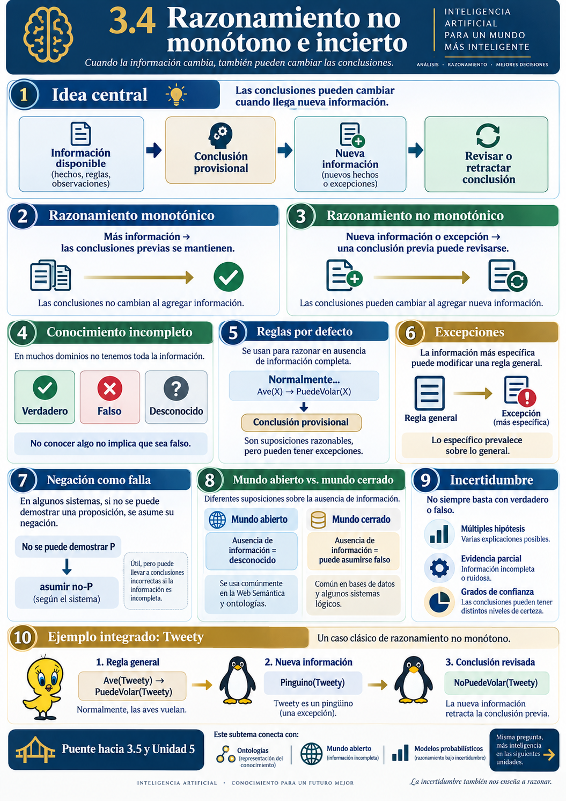
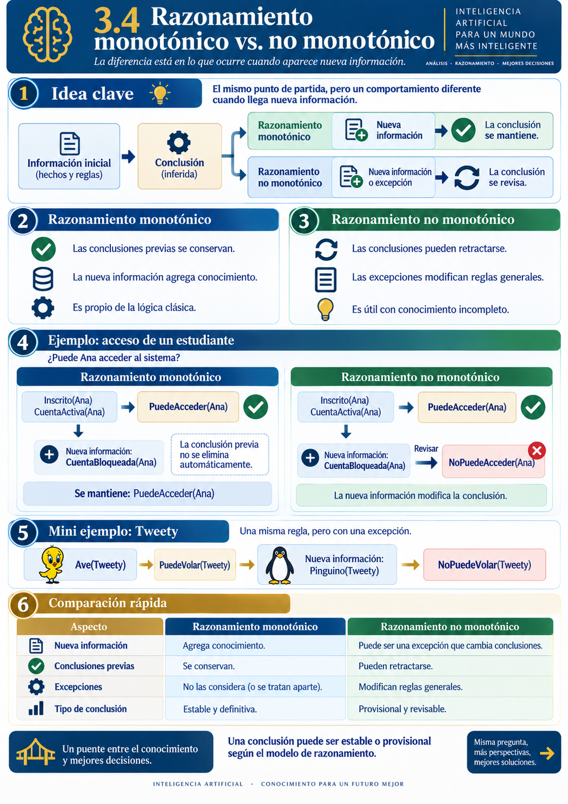
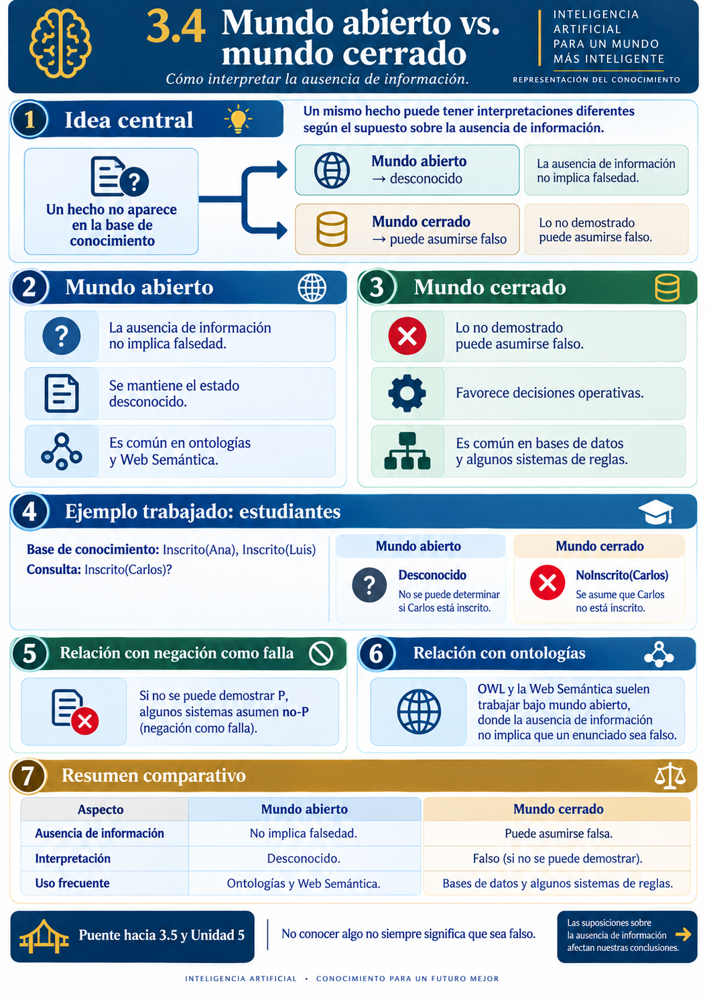

# 3.4 Razonamiento no monótono e incierto

## Propósito del subtema

Comprender cómo un sistema de Inteligencia Artificial puede razonar cuando la información disponible es **incompleta, contiene excepciones o puede cambiar**, distinguiendo entre razonamiento monotónico y no monotónico e introduciendo el problema de la incertidumbre.

Este subtema continúa directamente lo visto en 3.3:

```text
3.3
Hechos + reglas
      ↓
Inferencia
      ↓
Conclusiones

          ↓

3.4
Nueva información
Excepciones
Conocimiento incompleto
      ↓
¿Debe mantenerse la conclusión?
```

> **Idea central:** en algunos problemas, una conclusión válida con la información disponible puede necesitar revisarse cuando aparece nueva información.


<p align="center">
  
</p>


---

## 1. Del razonamiento basado en reglas al razonamiento revisable

En el subtema 3.3 trabajamos con reglas que permiten obtener conclusiones a partir de hechos. Ese enfoque funciona bien cuando el conocimiento es suficientemente completo y las reglas representan relaciones claras.

Sin embargo, en problemas reales puede ocurrir:

```text
Información inicial
       ↓
Conclusión
       ↓
Nueva información
       ↓
¿Sigue siendo válida la conclusión?
```

Ejemplo:

```text
Inscrito(Ana)
CuentaActiva(Ana)
```

Regla:

```text
SI Inscrito(X)
Y CuentaActiva(X)
ENTONCES PuedeAcceder(X)
```

Conclusión:

```text
PuedeAcceder(Ana)
```

Nueva información:

```text
CuentaBloqueada(Ana)
```

La nueva información obliga a revisar una conclusión anterior. Este tipo de situación motiva el estudio del **razonamiento no monotónico**.

---

## 2. Razonamiento monotónico

En un sistema de razonamiento **monotónico**, agregar nueva información no invalida las conclusiones que ya habían sido obtenidas correctamente.

```text
Conocimiento inicial
       ↓
Conclusión A

Agregar nueva información
       ↓

Conclusión A se conserva
```

> **El conjunto de conclusiones puede crecer, pero las conclusiones anteriores no se retiran.**

### 2.1 Ejemplo sencillo

```text
Mamifero(Perro1)
```

Regla:

```text
SI Mamifero(X)
ENTONCES Animal(X)
```

Conclusión:

```text
Animal(Perro1)
```

Después agregamos:

```text
Mascota(Perro1)
```

La conclusión `Animal(Perro1)` sigue siendo válida.

### 2.2 ¿Por qué se denomina monotónico?

Porque al aumentar el conocimiento disponible, no disminuye el conjunto de conclusiones válidas.

```text
Más conocimiento
      ↓
Iguales o más conclusiones
```

### 2.3 Ejemplo relacionado con 3.3

```text
equipo_no_enciende
led_apagado
```

Regla:

```text
SI equipo_no_enciende
Y led_apagado
ENTONCES revisar_alimentacion
```

Conclusión:

```text
revisar_alimentacion
```

Si después agregamos:

```text
bateria_descargada
```

la conclusión anterior permanece y puede permitir una nueva inferencia:

```text
revisar_alimentacion
        +
bateria_descargada
        ↓
posible_falla_bateria
```

---

## 3. Razonamiento no monotónico

El **razonamiento no monotónico** permite que una conclusión obtenida anteriormente sea **revisada o retirada** cuando aparece nueva información.

```text
Información inicial
       ↓
Conclusión provisional
       ↓
Nueva información
       ↓
Revisar conclusión
```

### 3.1 Ejemplo clásico: aves y pingüinos

```text
Ave(Tweety)
```

Regla general:

```text
Normalmente las aves vuelan.
```

Conclusión provisional:

```text
PuedeVolar(Tweety)
```

Nueva información:

```text
Pinguino(Tweety)
```

Excepción:

```text
Los pingüinos normalmente no vuelan.
```

Entonces:

```text
PuedeVolar(Tweety)
        ↓
      retirar
        ↓
NoPuedeVolar(Tweety)
```

### 3.2 La conclusión era provisional

Con la información inicial, la conclusión podía ser razonable. Al aparecer un hecho más específico, debe revisarse.

### 3.3 Ejemplo: acceso de estudiante

```text
Inscrito(Ana)
CuentaActiva(Ana)
        ↓
PuedeAcceder(Ana)
```

Nueva información:

```text
CuentaBloqueada(Ana)
```

Conclusión revisada:

```text
NoPuedeAcceder(Ana)
```

### 3.4 Ejemplo: sistema de riego

```text
SueloSeco
    ↓
ActivarRiego
```

Nueva información:

```text
LluviaInminente
```

Conclusión revisada:

```text
NoActivarRiego
```

---

## 4. Comparación: razonamiento monotónico vs. no monotónico

| Característica | Monotónico | No monotónico |
|---|---|---|
| Nueva información | Agrega conocimiento | Puede modificar el razonamiento |
| Conclusiones anteriores | Se conservan | Pueden revisarse |
| Excepciones | Requieren modelado explícito | Son parte natural del razonamiento |
| Tipo de conclusión | Estable | Puede ser provisional |
| Uso típico | Razonamiento lógico clásico | Conocimiento incompleto y excepciones |


<p align="center">
  
</p>

Forma sencilla de recordarlo:

**Razonamiento monotónico**

> ¿Qué nuevas conclusiones puedo agregar?

**Razonamiento no monotónico**

> ¿La nueva información obliga a revisar algo que había concluido antes?

### 4.1 No monotónico no significa simplemente incierto

El razonamiento no monotónico trata principalmente con:

```text
Nueva información
Excepciones
Conclusiones revisables
```

La incertidumbre puede involucrar preguntas como:

```text
¿Qué tan segura es una conclusión?
¿Qué probabilidad tiene un evento?
¿Qué tan confiable es la evidencia?
```

Son conceptos relacionados, pero no equivalentes.

---

## 5. Conocimiento incompleto

En muchos problemas de IA, el sistema no dispone de toda la información necesaria para afirmar que algo es verdadero o falso.

Ejemplo:

```text
SueloSeco
```

pero no tenemos información sobre:

```text
LluviaInminente
```

No podemos afirmar automáticamente:

```text
NoLluviaInminente
```

La situación correcta puede ser:

```text
LluviaInminente = desconocido
```

Conceptualmente podemos distinguir:

```text
Verdadero
Falso
Desconocido
```

> **No conocer un hecho no equivale necesariamente a saber que es falso.**

### 5.1 Ejemplo sencillo

```text
Inscrito(Ana)       → verdadero
CuentaActiva(Ana)   → desconocido
```

Con la regla:

```text
SI Inscrito(X)
Y CuentaActiva(X)
ENTONCES PuedeAcceder(X)
```

no podemos concluir todavía `PuedeAcceder(Ana)` porque falta información.

### 5.2 Falso vs. desconocido

Si sabemos explícitamente `CuentaBloqueada(Ana)`, existe evidencia de una condición. Si simplemente no existe información sobre el estado de la cuenta, el estado es desconocido.

---

## 6. Reglas por defecto

Una **regla por defecto** expresa lo que normalmente puede asumirse cuando no existe información que indique una excepción.

Ejemplo:

```text
Normalmente, las aves vuelan.
```

Conceptualmente:

```text
SI Ave(X)
Y no conocemos una excepción
ENTONCES PuedeVolar(X)
```

> **Mientras no aparezca información que contradiga la regla, aceptamos provisionalmente la conclusión.**

### 6.1 Ejemplo: aves

```text
Ave(Tweety)
        ↓
PuedeVolar(Tweety)
```

Si aparece:

```text
Pinguino(Tweety)
```

la conclusión debe revisarse.

### 6.2 Ejemplo: acceso de estudiante

```text
Normalmente:
Inscrito(X)
AND CuentaActiva(X)
→ PuedeAcceder(X)
```

Nueva información:

```text
CuentaBloqueada(Ana)
```

Resultado:

```text
NoPuedeAcceder(Ana)
```

### 6.3 Ejemplo: sistema de riego

```text
Normalmente:
SueloSeco → ActivarRiego
```

Nueva información:

```text
LluviaInminente
```

Conclusión revisada:

```text
NoActivarRiego
```

### 6.4 ¿Por qué son útiles?

Permiten representar conocimiento del tipo:

```text
Normalmente...
Generalmente...
En ausencia de información contraria...
Salvo que exista una excepción...
```

---

## 7. Excepciones

Una **excepción** es información que impide aplicar una regla general en un caso particular.

```text
Regla general
      ↓
Conclusión provisional
      ↓
Aparece excepción
      ↓
Conclusión revisada
```

### 7.1 Regla general y regla específica

```text
Regla general:
Ave(X) → PuedeVolar(X)

Regla más específica:
Pinguino(X) → NoPuedeVolar(X)
```

> **La información más específica puede modificar una conclusión obtenida mediante una regla más general.**

### 7.2 Ejemplo de acceso

```text
Inscrito(X)
AND CuentaActiva(X)
→ PuedeAcceder(X)
```

Excepción:

```text
CuentaBloqueada(X)
→ NoPuedeAcceder(X)
```

### 7.3 Ejemplo de riego

```text
SueloSeco → ActivarRiego
```

Excepción:

```text
LluviaInminente → NoActivarRiego
```

---

## 8. Revisión y retractación de conclusiones

En un sistema no monotónico, una conclusión puede ser válida con la información disponible en un momento determinado y dejar de serlo cuando aparece nueva evidencia.

```text
Información inicial
      ↓
Conclusión provisional
      ↓
Nueva información
      ↓
Revisión
      ↓
Mantener, modificar o retirar la conclusión
```

La palabra **retractación** describe el retiro de una conclusión que ya no debe mantenerse.

### 8.1 Revisar no significa borrar conocimiento

Los hechos iniciales pueden seguir siendo válidos. Lo que cambia es la conclusión derivada cuando aparece una excepción.

---

## 9. Negación como falla

La **negación como falla** (*negation as failure*) es una forma de razonamiento en la que un sistema puede tratar una afirmación como falsa cuando **no logra demostrarla**, bajo determinados supuestos.

```text
Intentar demostrar P
        ↓
No se puede demostrar
        ↓
Asumir no-P
```

> **No poder demostrar algo no siempre significa que sea falso.**

### 9.1 Ejemplo sencillo

Base de conocimiento:

```text
Inscrito(Ana)
Inscrito(Luis)
```

Consulta:

```text
Inscrito(Carlos)
```

El sistema no encuentra evidencia. Bajo negación como falla podría tratarlo como `NoInscrito(Carlos)`, pero también podría significar simplemente que no tenemos información sobre Carlos.

### 9.2 Relación con backward chaining

Si una meta no puede demostrarse, ciertos sistemas pueden interpretar ese fallo como evidencia de su negación.

### 9.3 ¿Por qué es no monotónico?

Si inicialmente no se puede demostrar `CuentaBloqueada(Ana)`, el sistema podría asumir `NoCuentaBloqueada(Ana)`. Si después aparece el hecho `CuentaBloqueada(Ana)`, la conclusión anterior debe retirarse.

---

## 10. Mundo abierto vs. mundo cerrado

La diferencia entre **falso** y **desconocido** puede entenderse mediante dos supuestos.

### 10.1 Supuesto de mundo cerrado

Si un hecho no puede demostrarse, puede asumirse falso.

```text
No está en la base de conocimiento
        ↓
Se considera falso
```

Ejemplo:

```text
Inscrito(Ana)
Inscrito(Luis)
```

Si `Inscrito(Carlos)` no aparece, puede asumirse falso.

### 10.2 Supuesto de mundo abierto

Que un hecho no esté disponible no significa que sea falso.

```text
No está en la base de conocimiento
        ↓
Desconocido
```

Entonces `Inscrito(Carlos)` puede permanecer como desconocido.

### 10.3 Comparación

| Situación | Mundo cerrado | Mundo abierto |
|---|---|---|
| Un hecho aparece | Se considera verdadero | Se considera verdadero |
| Un hecho no aparece | Puede asumirse falso | Se considera desconocido |
| Ausencia de información | Se interpreta como negación | Se mantiene como desconocida |
| Uso frecuente | Bases de datos y ciertos sistemas de reglas | Ontologías y Web Semántica |


<p align="center">
  
</p>


### 10.4 Conexión con ontologías

Las ontologías expresadas en OWL trabajan generalmente bajo un **supuesto de mundo abierto**. Por tanto:

```text
No conocer algo
≠
Saber que es falso
```

---

## 11. Introducción al razonamiento incierto

En muchos problemas reales la información no es completamente segura.

Ejemplos:

```text
Es probable que la batería esté fallando.
Existe cierta evidencia de que lloverá.
El sensor parece indicar una temperatura anormal.
```

Aquí también debemos preguntar:

> **¿Qué tan segura es la conclusión?**

### 11.1 ¿De dónde puede provenir la incertidumbre?

a) **Información incompleta**

b) **Mediciones imprecisas**

c) **Variabilidad del entorno**

d) **Múltiples explicaciones posibles**

e) **Conocimiento aproximado**

### 11.2 No monotónico e incierto no son lo mismo

**No monotónico**

> ¿Debo revisar una conclusión cuando aparece nueva información?

**Incierto**

> ¿Qué tan segura es una determinada conclusión?

### 11.3 Alcance en este subtema

En 3.4 basta con comprender que `Verdadero / Falso` no siempre es suficiente. No desarrollaremos todavía probabilidad, teorema de Bayes, redes bayesianas o lógica difusa porque esos mecanismos se estudiarán en la Unidad 5.

---

## 12. Ejemplos integrados

### 12.1 Aves y pingüinos

```text
Ave(Tweety)
        ↓
Regla por defecto
        ↓
PuedeVolar(Tweety)

Nueva información:
Pinguino(Tweety)

        ↓
Excepción
        ↓
NoPuedeVolar(Tweety)
```

### 12.2 Acceso de estudiante

```text
Inscrito(Ana)
CuentaActiva(Ana)
        ↓
PuedeAcceder(Ana)

Nueva información:
CuentaBloqueada(Ana)

        ↓
NoPuedeAcceder(Ana)
```

### 12.3 Sistema de riego

```text
SueloSeco
      ↓
ActivarRiego

Nueva información:
LluviaInminente

      ↓
NoActivarRiego
```

---

## 13. Limitaciones

### 13.1 Conflictos entre reglas

```text
R1:
SueloSeco → ActivarRiego

R2:
LluviaInminente → NoActivarRiego
```

Si ambas condiciones se cumplen, aparecen conclusiones incompatibles. El sistema puede necesitar criterios como prioridad, especificidad, contexto o nueva evidencia.

### 13.2 Las reglas por defecto dependen del dominio

Deben diseñarse cuidadosamente para el contexto en el que serán utilizadas.

### 13.3 La retractación debe estar justificada

No cualquier nueva información debería modificar una conclusión anterior. Debe existir una relación clara entre la nueva información y la conclusión revisada.

### 13.4 La incertidumbre requiere mecanismos adicionales

Una regla no monotónica puede representar `Normalmente ocurre X`, pero no necesariamente responder `¿Con qué probabilidad ocurre X?`.

---

## 14. Conexión con 3.5 y con la Unidad 5

### 14.1 Conexión con 3.5

En 3.5 retomaremos la idea de que:

```text
Ausencia de información
≠
Información falsa
```

La progresión será:

```text
3.4
Conocimiento incompleto
Mundo abierto / cerrado
        ↓
3.5
Ontologías
Web Semántica
Grafos de conocimiento
```

### 14.2 Conexión con la Unidad 5

En 3.4 identificamos situaciones como:

```text
Información incompleta
Múltiples hipótesis
Datos imprecisos
Conclusiones con distintos grados de confianza
```

Posteriormente:

```text
3.4
Reconocer la incertidumbre
        ↓
Unidad 5
Modelarla matemáticamente
```

Ahí se estudiarán herramientas como probabilidad, redes bayesianas y lógica difusa.

---

## Síntesis del subtema

```text
MONOTÓNICO
Las conclusiones se mantienen

NO MONOTÓNICO
Las conclusiones pueden revisarse

CONOCIMIENTO INCOMPLETO
Puede existir información desconocida

REGLAS POR DEFECTO
Permiten conclusiones provisionales

EXCEPCIONES
Pueden modificar reglas generales

NEGACIÓN COMO FALLA
No demostrar P puede interpretarse como no-P
bajo determinados supuestos

MUNDO ABIERTO
Ausencia de información ≠ falsedad

MUNDO CERRADO
Ausencia de información puede asumirse falsa

INCERTIDUMBRE
No siempre basta con verdadero o falso
```

> **Idea final:** un sistema inteligente no siempre razona con conocimiento completo y definitivo. En muchos problemas debe aceptar conclusiones provisionales, reconocer excepciones y revisar sus decisiones cuando aparece nueva información.

---

## Recursos complementarios

- [Recursos del subtema](./recursos/README.md)
- [Notebook comparativo](./notebooks/3.4-razonamiento-monotono-no-monotono.ipynb)
- [Actividad de aprendizaje](./actividades/README.md)
- [Imágenes e infografías](./imagenes/)

La **autoevaluación del subtema 3.4** se realizará en Moodle.

---

## Referencias base

- Poole, D. L., & Mackworth, A. K. (2023). *Artificial Intelligence: Foundations of Computational Agents* (3rd ed.).
- Russell, S. J., & Norvig, P. (2021). *Artificial Intelligence: A Modern Approach* (4th ed.). Pearson.
- Stanford Encyclopedia of Philosophy. *Non-monotonic Logic*.
- Temario oficial de la asignatura **Introducción a la Inteligencia Artificial**, Maestría en Sistemas Computacionales, TecNM.
- Instrumentación Didáctica de Asignaturas de Posgrado, TecNM, revisión 001.

---

## Navegación

- [← Volver a la Unidad 3](../README.md)
- [← Subtema 3.3: Sistemas de inferencia](../3.3-sistemas-de-inferencia/README.md)
- **Siguiente:** 3.5 Ontologías en la Web Semántica y grafos de conocimiento
