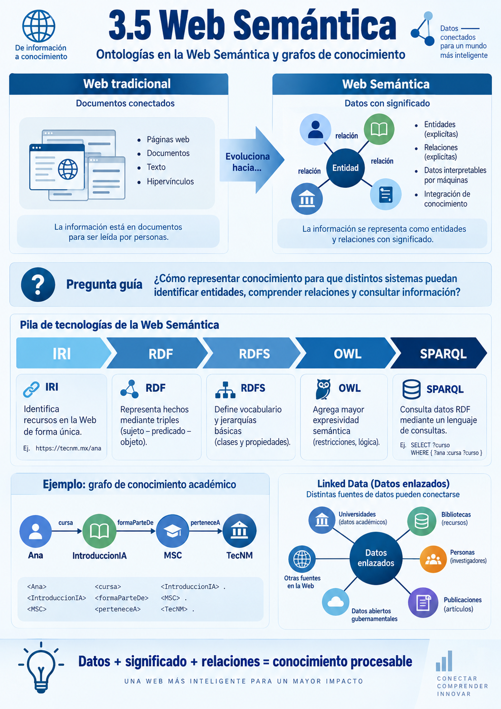
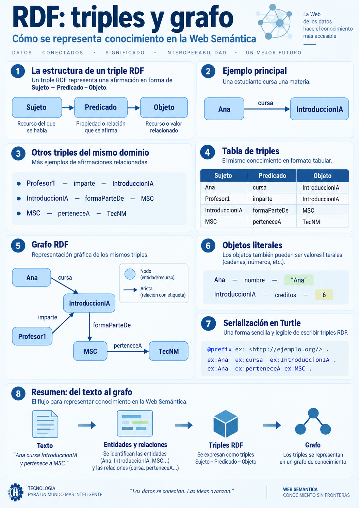
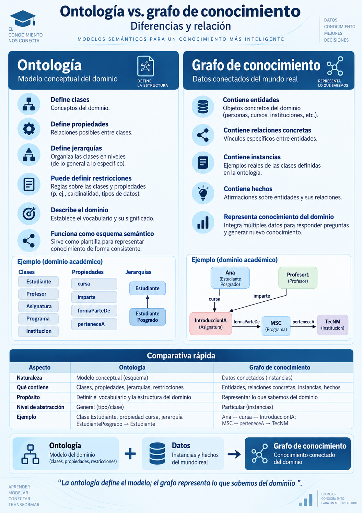

# 3.5 Ontologías en la Web Semántica y grafos de conocimiento

## Propósito del subtema

Comprender cómo las ontologías se utilizan en la **Web Semántica** y en los **grafos de conocimiento** para representar, vincular y consultar información estructurada mediante tecnologías como **RDF, RDFS, OWL y SPARQL**.

Este subtema integra conceptos trabajados previamente en la Unidad 3:

```text
3.2
Ontologías
Clases
Propiedades
Individuos
OWL
        ↓
3.4
Conocimiento incompleto
Mundo abierto
        ↓
3.5
RDF
Web Semántica
Datos enlazados
SPARQL
Grafos de conocimiento
```

> **Pregunta central:** ¿cómo podemos representar conocimiento de forma que diferentes sistemas puedan identificar entidades, comprender sus relaciones y consultar esa información automáticamente?


<p align="center">
  
</p>


---

## 1. De la Web tradicional a la Web Semántica

La Web convencional está formada principalmente por:

```text
Páginas
Documentos
Texto
Imágenes
Hipervínculos
```

Estos recursos están diseñados principalmente para que las personas los interpreten.

Por ejemplo:

```text
Ana estudia Inteligencia Artificial.
Ana pertenece a la Maestría en Sistemas Computacionales.
La Maestría pertenece al TecNM.
```

Una persona puede reconocer fácilmente entidades y relaciones:

```text
Entidades:
Ana
Inteligencia Artificial
Maestría en Sistemas Computacionales
TecNM

Relaciones:
estudia
perteneceA
```

El problema es que, si la información se encuentra únicamente como texto, un sistema computacional no necesariamente dispone de una representación explícita de esas relaciones.

Podemos hacerlas visibles mediante:

```text
Ana ── estudia ──► InteligenciaArtificial
```

Ahora distinguimos:

```text
Entidad
Relación
Entidad
```

Este cambio es fundamental para representar conocimiento de manera procesable.

---

## 2. ¿Qué es la Web Semántica?

La **Web Semántica** propone representar datos en la Web de forma estructurada y con relaciones explícitas, utilizando estándares que permitan que diferentes sistemas puedan interpretar e integrar esa información.

No significa que la Web “piense” como una persona.

La idea es proporcionar una representación formal del significado de los datos.

```text
Datos
  +
Identificadores
  +
Relaciones
  +
Vocabularios
  =
Información procesable semánticamente
```

### 2.1 Ejemplo

```text
Ana ── cursa ──► IntroduccionIA

IntroduccionIA ── formaParteDe ──► MSC

MSC ── perteneceA ──► TecNM
```

La información deja de ser únicamente texto y comienza a formar una red de entidades relacionadas.

---

## 3. Tecnologías principales de la Web Semántica

Para este subtema trabajaremos con cinco componentes fundamentales:

```text
IRI
 ↓
RDF
 ↓
RDFS
 ↓
OWL
 ↓
SPARQL
```

| Tecnología | Función principal |
|---|---|
| IRI | Identificar recursos |
| RDF | Representar hechos mediante triples |
| RDFS | Definir vocabulario y jerarquías básicas |
| OWL | Representar conocimiento y restricciones más expresivas |
| SPARQL | Consultar datos RDF |

Estas tecnologías cumplen funciones complementarias.

---

## 4. IRI e identificación de recursos

Un **IRI** (*Internationalized Resource Identifier*) permite identificar un recurso de forma inequívoca dentro de un contexto determinado.

Ejemplos:

```text
http://ejemplo.org/personas/Ana
http://ejemplo.org/programas/MSC
http://ejemplo.org/asignaturas/IntroduccionIA
```

La idea es:

```text
Nombre local
     ↓
Identificador global
     ↓
Recurso distinguible
```

### 4.1 ¿Para qué sirve un IRI?

Puede identificar:

a) Una persona

b) Una institución

c) Una asignatura

d) Una clase

e) Una propiedad

f) Cualquier otro recurso representado en el grafo

En RDF, tanto las entidades como las propiedades pueden identificarse mediante IRIs.

---

## 5. RDF: Resource Description Framework

**RDF** es un modelo para representar información mediante declaraciones estructuradas.

Su unidad fundamental es el **triple**:

```text
Sujeto ── Predicado ──► Objeto
```

También puede escribirse:

```text
(Sujeto, Predicado, Objeto)
```

### 5.1 Ejemplo

```text
(Ana, cursa, IntroduccionIA)
```

Visualmente:

```text
Ana ── cursa ──► IntroduccionIA
```

Tenemos:

```text
Sujeto:
Ana

Predicado:
cursa

Objeto:
IntroduccionIA
```

### 5.2 Varios triples

```text
(Ana, cursa, IntroduccionIA)

(Profesor1, imparte, IntroduccionIA)

(IntroduccionIA, formaParteDe, MSC)

(MSC, perteneceA, TecNM)
```

---

## 6. De los triples al grafo

Cuando agregamos varios triples, obtenemos naturalmente una estructura de grafo.

```text
                    Profesor1
                        │
                     imparte
                        ↓
Ana ── cursa ──► IntroduccionIA
                        │
                   formaParteDe
                        ↓
                       MSC
                        │
                    perteneceA
                        ↓
                      TecNM
```

> **Un conjunto de triples RDF puede interpretarse naturalmente como un grafo.**

### 6.1 Nodos

```text
Ana
Profesor1
IntroduccionIA
MSC
TecNM
```

### 6.2 Relaciones

```text
cursa
imparte
formaParteDe
perteneceA
```

Por tanto:

```text
Nodos
  +
Relaciones
  =
Grafo
```

### 6.3 Representación tabular

| Sujeto | Predicado | Objeto |
|---|---|---|
| Ana | cursa | IntroduccionIA |
| Profesor1 | imparte | IntroduccionIA |
| IntroduccionIA | formaParteDe | MSC |
| MSC | perteneceA | TecNM |


<p align="center">
  
</p>


---

## 7. ¿Qué puede aparecer en un triple RDF?

Un triple RDF tiene:

```text
Sujeto
Predicado
Objeto
```

### 7.1 Sujeto

Identifica el recurso del que estamos hablando.

```text
Ana
```

### 7.2 Predicado

Identifica la propiedad o relación.

```text
cursa
```

### 7.3 Objeto

Puede ser otro recurso:

```text
IntroduccionIA
```

o un valor literal:

```text
"2026"
25
6
```

Ejemplos:

```text
Ana ── nombre ──► "Ana"

IntroduccionIA ── creditos ──► 6
```

---

## 8. RDF/Turtle: una forma de escribir el grafo

Una de las serializaciones más utilizadas para RDF es **Turtle**.

### 8.1 Definición de un prefijo

```turtle
@prefix ex: <http://ejemplo.org/> .
```

Después:

```turtle
ex:Ana ex:cursa ex:IntroduccionIA .
```

representa:

```text
Ana ── cursa ──► IntroduccionIA
```

### 8.2 Varios triples

```turtle
@prefix ex: <http://ejemplo.org/> .

ex:Ana
    ex:cursa ex:IntroduccionIA .

ex:Profesor1
    ex:imparte ex:IntroduccionIA .

ex:IntroduccionIA
    ex:formaParteDe ex:MSC .

ex:MSC
    ex:perteneceA ex:TecNM .
```

### 8.3 Agrupación de propiedades

```turtle
ex:Ana
    ex:cursa ex:IntroduccionIA ;
    ex:perteneceA ex:MSC .
```

Esto representa dos triples con el mismo sujeto.

### 8.4 Literales

```turtle
ex:Ana
    ex:nombre "Ana" ;
    ex:edad 25 .
```

### 8.5 Tipo de recurso

```turtle
ex:Ana rdf:type ex:Estudiante .
```

En Turtle también puede escribirse:

```turtle
ex:Ana a ex:Estudiante .
```

La expresión `a` es una abreviatura de `rdf:type`.

---

## 9. RDF vs. RDFS vs. OWL

Estas tecnologías están relacionadas, pero cumplen funciones diferentes.

### 9.1 RDF: representar hechos

```turtle
ex:Ana ex:cursa ex:IntroduccionIA .
```

Representa el hecho:

```text
Ana cursa IntroduccionIA
```

### 9.2 RDFS: definir estructura básica

```turtle
ex:Estudiante a rdfs:Class .
```

También:

```turtle
ex:EstudiantePosgrado
    rdfs:subClassOf ex:Estudiante .
```

Conceptualmente:

```text
EstudiantePosgrado
        ↓
subclase de
        ↓
Estudiante
```

### 9.3 Dominio y rango

```turtle
ex:cursa
    rdfs:domain ex:Estudiante ;
    rdfs:range ex:Asignatura .
```

Conceptualmente:

```text
Estudiante ── cursa ──► Asignatura
```

En RDFS, `domain` y `range` tienen significado inferencial.

Si:

```turtle
ex:Ana ex:cursa ex:IntroduccionIA .
```

y:

```turtle
ex:cursa rdfs:domain ex:Estudiante .
```

un razonador puede inferir:

```text
Ana es Estudiante
```

De manera semejante, si:

```turtle
ex:cursa rdfs:range ex:Asignatura .
```

puede inferirse:

```text
IntroduccionIA es Asignatura
```

Esto conecta con el subtema 3.3.

### 9.4 OWL: conocimiento más expresivo

OWL permite expresar conocimiento y restricciones más ricas, por ejemplo:

```text
Clases equivalentes
Clases disjuntas
Restricciones
Cardinalidades
Propiedades inversas
Características de propiedades
```

Ejemplo conceptual:

```text
AsignaturaPosgrado
≡
Asignatura
AND
formaParteDe SOME ProgramaPosgrado
```

### 9.5 Comparación

| Tecnología | Pregunta principal |
|---|---|
| RDF | ¿Qué hechos existen? |
| RDFS | ¿Cómo está estructurado el vocabulario? |
| OWL | ¿Qué conocimiento y restricciones más expresivas podemos representar? |

---

## 10. SPARQL: consultar un grafo RDF

SPARQL permite formular consultas sobre grafos RDF mediante patrones.

### 10.1 Primer ejemplo

Supongamos:

```text
Ana ── cursa ──► IntroduccionIA
Luis ── cursa ──► BasesDatos
Maria ── cursa ──► IntroduccionIA
```

Pregunta:

> ¿Quién cursa Introducción a la Inteligencia Artificial?

Consulta:

```sparql
PREFIX ex: <http://ejemplo.org/>

SELECT ?estudiante
WHERE {
    ?estudiante ex:cursa ex:IntroduccionIA .
}
```

Resultado:

```text
Ana
Maria
```

### 10.2 Variables

```text
?estudiante
```

representa una variable.

La consulta:

```sparql
?estudiante ex:cursa ex:IntroduccionIA .
```

busca triples que coincidan con:

```text
(?estudiante, cursa, IntroduccionIA)
```

### 10.3 Varias condiciones

```sparql
PREFIX ex: <http://ejemplo.org/>

SELECT ?estudiante
WHERE {
    ?estudiante ex:cursa ex:IntroduccionIA .
    ?estudiante ex:perteneceA ex:MSC .
}
```

### 10.4 Relaciones encadenadas

```sparql
PREFIX ex: <http://ejemplo.org/>

SELECT ?institucion
WHERE {
    ex:Ana ex:cursa ?asignatura .
    ?asignatura ex:formaParteDe ?programa .
    ?programa ex:perteneceA ?institucion .
}
```

Conceptualmente:

```text
Ana
 ↓ cursa
Asignatura
 ↓ formaParteDe
Programa
 ↓ perteneceA
Institucion
```

### 10.5 SPARQL como búsqueda de patrones

```text
Grafo completo
      ↓
Patrón solicitado
      ↓
Coincidencias
      ↓
Resultados
```

### 10.6 Consulta e inferencia no son lo mismo

SPARQL:

```text
Consulta información
```

La inferencia puede provenir de:

```text
RDFS
OWL
Reglas
Razonadores
```

Por tanto:

```text
Ontología / grafo
       ↓
Razonamiento
       ↓
Nuevos hechos inferidos
       ↓
Consulta
```

---

## 11. Linked Data: datos enlazados

**Linked Data** propone conectar datos distribuidos mediante identificadores y relaciones explícitas.

```text
Datos de una fuente
        ↓
se conectan con
        ↓
Datos de otras fuentes
```

### 11.1 Principios básicos

a) Utilizar identificadores globales para los recursos

b) Utilizar identificadores consultables en la Web

c) Proporcionar información estructurada sobre esos recursos

d) Incluir enlaces hacia otros recursos relacionados

### 11.2 Ejemplo

```text
Investigador1
      │
      ├── participaEn ──► ProyectoIA
      │
      └── autorDe ──────► Articulo1

ProyectoIA
      │
      └── perteneceA ───► Institucion1
```

---

## 12. Grafos de conocimiento

Un **grafo de conocimiento** representa entidades de un dominio y las relaciones existentes entre ellas mediante una estructura de nodos y aristas.

```text
Entidades
   +
Relaciones
   +
Semántica
   =
Grafo de conocimiento
```

Ejemplo:

```text
Ana
 │
 ├── cursa ─────────────► IntroduccionIA
 │
 └── perteneceA ────────► MSC

Profesor1
 │
 └── imparte ───────────► IntroduccionIA

MSC
 │
 └── perteneceA ────────► TecNM
```

### 12.1 Nodos

```text
Ana
Profesor1
IntroduccionIA
MSC
TecNM
```

### 12.2 Aristas

```text
cursa
imparte
perteneceA
formaParteDe
```

### 12.3 Propiedades

```text
Ana
 ├── nombre → "Ana"
 └── matricula → "M001"
```

### 12.4 No todo grafo es un grafo de conocimiento

Un grafo matemático puede carecer de significado explícito.

En cambio:

```text
Ana ── cursa ──► IntroduccionIA
```

tiene semántica.

### 12.5 No todos los grafos de conocimiento utilizan RDF y OWL

Pueden implementarse con distintas tecnologías.

En este curso nos enfocaremos en:

```text
Web Semántica
+
RDF
+
Ontologías
```

---

## 13. Ontología vs. grafo de conocimiento

### 13.1 Ontología

Define el modelo conceptual del dominio.

```text
Clases:
Estudiante
Profesor
Asignatura
Programa
Institucion

Propiedades:
cursa
imparte
formaParteDe
perteneceA
```

Responde:

> **¿Qué tipos de cosas existen en este dominio y cómo pueden relacionarse?**

### 13.2 Grafo de conocimiento

Contiene instancias y hechos concretos.

```text
Ana → Estudiante
IntroduccionIA → Asignatura
MSC → Programa
TecNM → Institucion
```

y:

```text
Ana ── cursa ──► IntroduccionIA
IntroduccionIA ── formaParteDe ──► MSC
MSC ── perteneceA ──► TecNM
```

Responde:

> **¿Qué entidades concretas conocemos y qué relaciones existen entre ellas?**

### 13.3 Comparación

| Ontología | Grafo de conocimiento |
|---|---|
| Define clases | Contiene entidades |
| Define propiedades | Contiene relaciones concretas |
| Define jerarquías | Contiene instancias |
| Puede definir restricciones | Contiene hechos |
| Describe el dominio | Representa conocimiento del dominio |
| Puede servir como esquema semántico | Puede utilizar ese esquema |


<p align="center">
  
</p>


```text
ONTOLOGÍA
Define las reglas del mundo

        ↓

GRAFO DE CONOCIMIENTO
Representa lo que sabemos de ese mundo
```

---

## 14. Construcción de un pequeño grafo de conocimiento

### Paso 1. Definir el dominio

```text
Sistema académico de posgrado
```

### Paso 2. Identificar tipos de entidades

```text
Estudiante
Profesor
Asignatura
Programa
Institucion
```

### Paso 3. Identificar relaciones

```text
cursa
imparte
formaParteDe
perteneceA
```

### Paso 4. Crear instancias

```text
Ana
Luis
Profesor1
IntroduccionIA
BasesDatos
MSC
TecNM
```

### Paso 5. Crear triples

```text
(Ana, cursa, IntroduccionIA)

(Luis, cursa, BasesDatos)

(Profesor1, imparte, IntroduccionIA)

(IntroduccionIA, formaParteDe, MSC)

(BasesDatos, formaParteDe, MSC)

(MSC, perteneceA, TecNM)
```

### Paso 6. Formular preguntas

```text
¿Qué asignaturas cursa Ana?

¿Qué profesor imparte IntroduccionIA?

¿A qué programa pertenece IntroduccionIA?

¿A qué institución pertenece ese programa?
```

---

## 15. Aplicaciones de los grafos de conocimiento

### 15.1 Búsqueda semántica

Permiten aprovechar relaciones entre entidades y conceptos.

### 15.2 Sistemas de recomendación

```text
Usuario ── interesadoEn ──► IA

Curso1 ── trataSobre ──► IA
```

### 15.3 Sistemas de preguntas y respuestas

```text
Profesor
   ↓ imparte
Asignatura
   ↓ formaParteDe
MSC
```

### 15.4 Integración de información

```text
Investigador1
 ├── autorDe ─────► Articulo1
 ├── participaEn ─► Proyecto1
 └── perteneceA ──► Institucion1
```

### 15.5 Sistemas expertos

```text
Ontologías
+
Grafos de conocimiento
+
Reglas
+
Inferencia
```

### 15.6 Relación con sistemas actuales

Los grafos de conocimiento aportan información:

```text
Estructurada
Relacionada
Identificable
Consultable
```

Conceptos como:

```text
Graph Neural Networks
Knowledge Graph Embeddings
GraphRAG
```

quedan fuera del alcance de este subtema.

---

## 16. Mundo abierto y grafos semánticos

Este punto conecta con el subtema 3.4.

Si el grafo contiene:

```text
Ana ── cursa ──► IntroduccionIA
```

pero no contiene:

```text
Luis ── cursa ──► IntroduccionIA
```

en un entorno de mundo abierto no debemos concluir automáticamente:

```text
Luis no cursa IntroduccionIA
```

Lo correcto puede ser:

```text
No tenemos información suficiente
```

Por tanto:

```text
Ausencia de un triple
        ≠
Negación del triple
```

---

## 17. Inferencia en un grafo de conocimiento

Un grafo puede contener hechos explícitos y permitir obtener información derivada.

Supongamos:

```text
EstudiantePosgrado
      ↓ subclase de
Estudiante
```

y:

```text
Ana → EstudiantePosgrado
```

Un razonador puede inferir:

```text
Ana → Estudiante
```

La secuencia es:

```text
Conocimiento explícito
        ↓
Reglas / semántica
        ↓
Inferencia
        ↓
Conocimiento derivado
```

### 17.1 Ejemplo con dominio

```text
cursa
domain → Estudiante
```

y:

```text
Ana ── cursa ──► IntroduccionIA
```

puede permitir inferir:

```text
Ana → Estudiante
```

---

## 18. Limitaciones y retos

### 18.1 Calidad de los datos

```text
Datos incorrectos
       ↓
Grafo incorrecto
       ↓
Consultas o inferencias incorrectas
```

### 18.2 Duplicidad de entidades

Dos identificadores pueden representar la misma entidad.

### 18.3 Diferentes vocabularios

Un sistema puede utilizar:

```text
cursa
```

y otro:

```text
estaInscritoEn
```

para relaciones similares.

### 18.4 Actualización del conocimiento

Una relación puede ser válida en un periodo y dejar de serlo posteriormente.

### 18.5 Escalabilidad

Un grafo real puede contener miles o millones de relaciones.

### 18.6 Diseño de la ontología

La calidad de:

```text
Clases
Relaciones
Jerarquías
Identificadores
Restricciones
```

afecta directamente la utilidad del grafo.

---

## 19. Síntesis del subtema

```text
MUNDO REAL
    ↓
Entidades
    ↓
IRI
    ↓
Triples RDF
    ↓
Grafo RDF
    ↓
RDFS / OWL
    ↓
Ontología
    ↓
Grafo de conocimiento
    ↓
SPARQL
    ↓
Consulta e inferencia
```

Otra forma de verlo:

```text
ONTOLOGÍA
Define:
qué entidades existen
qué relaciones pueden tener
qué restricciones aplican

        +

DATOS
Instancias y hechos concretos

        ↓

GRAFO DE CONOCIMIENTO
```

Finalmente:

```text
GRAFO
   +
CONSULTA
   +
INFERENCIA
   =
CONOCIMIENTO UTILIZABLE
```

---

## 20. Integración de toda la Unidad 3

```text
3.1
Lógica
¿Cómo representamos formalmente conocimiento?
        ↓

3.2
Redes semánticas, marcos y ontologías
¿Cómo organizamos el conocimiento?
        ↓

3.3
Sistemas de inferencia
¿Cómo obtenemos nuevas conclusiones?
        ↓

3.4
Razonamiento no monotónico e incierto
¿Qué ocurre con conocimiento incompleto o revisable?
        ↓

3.5
Web Semántica y grafos de conocimiento
¿Cómo representamos, vinculamos y consultamos
conocimiento estructurado?
```

> **Resultado esperado:** al finalizar 3.5, el estudiante podrá explicar y aplicar la relación **Ontología → RDF → Grafo → SPARQL → Consulta e inferencia**, distinguiendo además entre una ontología y un grafo de conocimiento.

---

## Recursos complementarios

- [Recursos del subtema](./recursos/README.md)
- [Notebook RDFLib + SPARQL](./notebooks/3.5-rdflib-sparql.ipynb)
- [Actividad de aprendizaje](./actividades/README.md)
- [Imágenes e infografías](./imagenes/)

La **autoevaluación del subtema 3.5** se realizará en Moodle.

---

## Referencias base

- W3C. *RDF 1.1 Concepts and Abstract Syntax*.
- W3C. *RDF 1.1 Turtle*.
- W3C. *RDF Schema 1.1*.
- W3C. *OWL 2 Web Ontology Language Primer*.
- W3C. *SPARQL 1.1 Query Language*.
- Poole, D. L., & Mackworth, A. K. (2023). *Artificial Intelligence: Foundations of Computational Agents* (3rd ed.).
- Russell, S. J., & Norvig, P. (2021). *Artificial Intelligence: A Modern Approach* (4th ed.). Pearson.
- Temario oficial de la asignatura **Introducción a la Inteligencia Artificial**, Maestría en Sistemas Computacionales, TecNM.

---

## Navegación

- [← Volver a la Unidad 3](../README.md)
- [← Subtema 3.4: Razonamiento no monótono e incierto](../3.4-razonamiento-no-monotono-e-incierto/README.md)
